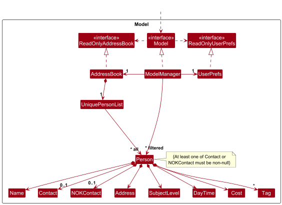
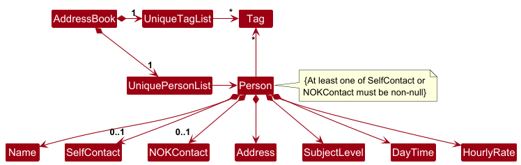

* Table of Contents
{:toc}

--------------------------------------------------------------------------------------------------------------------

## **Acknowledgements**

* {list here sources of all reused/adapted ideas, code, documentation, and third-party libraries -- include links to the original source as well}

--------------------------------------------------------------------------------------------------------------------

## **Setting up, getting started**

Refer to the guide [_Setting up and getting started_](SettingUp.md).

--------------------------------------------------------------------------------------------------------------------

## **Design**

:bulb: **Tip:** The `.puml` files used to create diagrams are in this document `docs/diagrams` folder. Refer to the [_PlantUML Tutorial_ at se-edu/guides](https://se-education.org/guides/tutorials/plantUml.html) to learn how to create and edit diagrams.

### Architecture

The ***Architecture Diagram*** given above explains the high-level design of the App.

Given below is a quick overview of main components and how they interact with each other.

**Main components of the architecture**

**`Main`** (consisting of classes [`Main`](https://github.com/se-edu/addressbook-level3/tree/master/src/main/java/seedu/address/Main.java) and [`MainApp`](https://github.com/se-edu/addressbook-level3/tree/master/src/main/java/seedu/address/MainApp.java)) is in charge of the app launch and shut down.
* At app launch, it initializes the other components in the correct sequence, and connects them up with each other.
* At shut down, it shuts down the other components and invokes cleanup methods where necessary.

The bulk of the app's work is done by the following four components:

* [**`UI`**](#ui-component): The UI of the App.
* [**`Logic`**](#logic-component): The command executor.
* [**`Model`**](#model-component): Holds the data of the App in memory.
* [**`Storage`**](#storage-component): Reads data from, and writes data to, the hard disk.

[**`Commons`**](#common-classes) represents a collection of classes used by multiple other components.

**How the architecture components interact with each other**

The *Sequence Diagram* below shows how the components interact with each other for the scenario where the user issues the command `delete 1`.

Each of the four main components (also shown in the diagram above),

* defines its *API* in an `interface` with the same name as the Component.
* implements its functionality using a concrete `{Component Name}Manager` class (which follows the corresponding API `interface` mentioned in the previous point.

For example, the `Logic` component defines its API in the `Logic.java` interface and implements its functionality using the `LogicManager.java` class which follows the `Logic` interface. Other components interact with a given component through its interface rather than the concrete class (reason: to prevent outside component's being coupled to the implementation of a component), as illustrated in the (partial) class diagram below.

The sections below give more details of each component.

### UI component

The **API** of this component is specified in [`Ui.java`](https://github.com/se-edu/addressbook-level3/tree/master/src/main/java/seedu/address/ui/Ui.java)

The UI consists of a `MainWindow` that is made up of parts e.g.`CommandBox`, `ResultDisplay`, `PersonListPanel`, `StatusBarFooter` etc. All these, including the `MainWindow`, inherit from the abstract `UiPart` class which captures the commonalities between classes that represent parts of the visible GUI.

The `UI` component uses the JavaFx UI framework. The layout of these UI parts are defined in matching `.fxml` files that are in the `src/main/resources/view` folder. For example, the layout of the [`MainWindow`](https://github.com/se-edu/addressbook-level3/tree/master/src/main/java/seedu/address/ui/MainWindow.java) is specified in [`MainWindow.fxml`](https://github.com/se-edu/addressbook-level3/tree/master/src/main/resources/view/MainWindow.fxml)

The `UI` component,

* executes user commands using the `Logic` component.
* listens for changes to `Model` data so that the UI can be updated with the modified data.
* keeps a reference to the `Logic` component, because the `UI` relies on the `Logic` to execute commands.
* depends on some classes in the `Model` component, as it displays `Person` object residing in the `Model`.

### Logic component

**API** : [`Logic.java`](https://github.com/se-edu/addressbook-level3/tree/master/src/main/java/seedu/address/logic/Logic.java)

Here's a (partial) class diagram of the `Logic` component:

The sequence diagram below illustrates the interactions within the `Logic` component, taking `execute("delete 1")` API call as an example.

:information_source: **Note:** The lifeline for `DeleteCommandParser` should end at the destroy marker (X) but due to a limitation of PlantUML, the lifeline continues till the end of diagram.

How the `Logic` component works:

1. When `Logic` is called upon to execute a command, it is passed to an `AddressBookParser` object which in turn creates a parser that matches the command (e.g., `DeleteCommandParser`) and uses it to parse the command.
1. This results in a `Command` object (more precisely, an object of one of its subclasses e.g., `DeleteCommand`) which is executed by the `LogicManager`.
1. The command can communicate with the `Model` when it is executed (e.g. to delete a person). 
   Note that although this is shown as a single step in the diagram above (for simplicity), in the code it can take several interactions (between the command object and the `Model`) to achieve.
1. The result of the command execution is encapsulated as a `CommandResult` object which is returned back from `Logic`.

Here are the other classes in `Logic` (omitted from the class diagram above) that are used for parsing a user command:

How the parsing works:
* When called upon to parse a user command, the `AddressBookParser` class creates an `XYZCommandParser` (`XYZ` is a placeholder for the specific command name e.g., `AddCommandParser`) which uses the other classes shown above to parse the user command and create a `XYZCommand` object (e.g., `AddCommand`) which the `AddressBookParser` returns back as a `Command` object.
* All `XYZCommandParser` classes (e.g., `AddCommandParser`, `DeleteCommandParser`, ...) inherit from the `Parser` interface so that they can be treated similarly where possible e.g, during testing.

### Model component
**API** : [`Model.java`](https://github.com/se-edu/addressbook-level3/tree/master/src/main/java/seedu/address/model/Model.java)

The `Model` component,

* stores the address book data i.e., all `Person` objects (which are contained in a `UniquePersonList` object).
* stores the currently 'selected' `Person` objects (e.g., results of a search query) as a separate _filtered_ list which is exposed to outsiders as an unmodifiable `ObservableList<Person>` that can be 'observed' e.g. the UI can be bound to this list so that the UI automatically updates when the data in the list change.
* stores a `UserPref` object that represents the user’s preferences. This is exposed to the outside as a `ReadOnlyUserPref` objects.
* does not depend on any of the other three components (as the `Model` represents data entities of the domain, they should make sense on their own without depending on other components)

:information_source: **Note:** An alternative (arguably, a more OOP) model is given below. It has a `Tag` list in the `AddressBook`, which `Person` references. This allows `AddressBook` to only require one `Tag` object per unique tag, instead of each `Person` needing their own `Tag` objects. 

### Storage component

**API** : [`Storage.java`](https://github.com/se-edu/addressbook-level3/tree/master/src/main/java/seedu/address/storage/Storage.java)

The `Storage` component,
* can save both address book data and user preference data in JSON format, and read them back into corresponding objects.
* inherits from both `AddressBookStorage` and `UserPrefStorage`, which means it can be treated as either one (if only the functionality of only one is needed).
* depends on some classes in the `Model` component (because the `Storage` component's job is to save/retrieve objects that belong to the `Model`)

### Common classes

Classes used by multiple components are in the `seedu.address.commons` package.

--------------------------------------------------------------------------------------------------------------------

## **Implementation**

This section describes some noteworthy details on how certain features are implemented.

### Find feature

The find feature allows users to search for persons by name (default) or by tags (with `t/` prefix).

#### Implementation

The find mechanism is implemented using predicates:
* `NameContainsKeywordsPredicate` - filters persons whose names match the keywords
* `TagContainsKeywordsPredicate` - filters persons whose tags match the keywords

The `FindCommandParser` detects the presence of the `t/` prefix using `ArgumentTokenizer`:
* If `t/` prefix is present, it creates a `FindCommand` with `TagContainsKeywordsPredicate`
* If `t/` prefix is absent, it creates a `FindCommand` with `NameContainsKeywordsPredicate` (default behavior)

Both predicates implement `Predicate<Person>` and use case-insensitive full-word matching via `StringUtil.containsWordIgnoreCase()`.

### \[Proposed\] Undo/redo feature

#### Proposed Implementation

The proposed undo/redo mechanism is facilitated by `VersionedAddressBook`. It extends `AddressBook` with an undo/redo history, stored internally as an `addressBookStateList` and `currentStatePointer`. Additionally, it implements the following operations:

* `VersionedAddressBook#commit()` — Saves the current address book state in its history.
* `VersionedAddressBook#undo()` — Restores the previous address book state from its history.
* `VersionedAddressBook#redo()` — Restores a previously undone address book state from its history.

These operations are exposed in the `Model` interface as `Model#commitAddressBook()`, `Model#undoAddressBook()` and `Model#redoAddressBook()` respectively.

Given below is an example usage scenario and how the undo/redo mechanism behaves at each step.

Step 1. The user launches the application for the first time. The `VersionedAddressBook` will be initialized with the initial address book state, and the `currentStatePointer` pointing to that single address book state.

Step 2. The user executes `delete 5` command to delete the 5th person in the address book. The `delete` command calls `Model#commitAddressBook()`, causing the modified state of the address book after the `delete 5` command executes to be saved in the `addressBookStateList`, and the `currentStatePointer` is shifted to the newly inserted address book state.

Step 3. The user executes `add n/David …​` to add a new person. The `add` command also calls `Model#commitAddressBook()`, causing another modified address book state to be saved into the `addressBookStateList`.

:information_source: **Note:** If a command fails its execution, it will not call `Model#commitAddressBook()`, so the address book state will not be saved into the `addressBookStateList`.

Step 4. The user now decides that adding the person was a mistake, and decides to undo that action by executing the `undo` command. The `undo` command will call `Model#undoAddressBook()`, which will shift the `currentStatePointer` once to the left, pointing it to the previous address book state, and restores the address book to that state.

:information_source: **Note:** If the `currentStatePointer` is at index 0, pointing to the initial AddressBook state, then there are no previous AddressBook states to restore. The `undo` command uses `Model#canUndoAddressBook()` to check if this is the case. If so, it will return an error to the user rather
than attempting to perform the undo.

The following sequence diagram shows how an undo operation goes through the `Logic` component:

:information_source: **Note:** The lifeline for `UndoCommand` should end at the destroy marker (X) but due to a limitation of PlantUML, the lifeline reaches the end of diagram.

Similarly, how an undo operation goes through the `Model` component is shown below:

The `redo` command does the opposite — it calls `Model#redoAddressBook()`, which shifts the `currentStatePointer` once to the right, pointing to the previously undone state, and restores the address book to that state.

:information_source: **Note:** If the `currentStatePointer` is at index `addressBookStateList.size() - 1`, pointing to the latest address book state, then there are no undone AddressBook states to restore. The `redo` command uses `Model#canRedoAddressBook()` to check if this is the case. If so, it will return an error to the user rather than attempting to perform the redo.

Step 5. The user then decides to execute the command `list`. Commands that do not modify the address book, such as `list`, will usually not call `Model#commitAddressBook()`, `Model#undoAddressBook()` or `Model#redoAddressBook()`. Thus, the `addressBookStateList` remains unchanged.

Step 6. The user executes `clear`, which calls `Model#commitAddressBook()`. Since the `currentStatePointer` is not pointing at the end of the `addressBookStateList`, all address book states after the `currentStatePointer` will be purged. Reason: It no longer makes sense to redo the `add n/David …​` command. This is the behavior that most modern desktop applications follow.

The following activity diagram summarizes what happens when a user executes a new command:

#### Design considerations:

**Aspect: How undo & redo executes:**

* **Alternative 1 (current choice):** Saves the entire address book.
  * Pros: Easy to implement.
  * Cons: May have performance issues in terms of memory usage.

* **Alternative 2:** Individual command knows how to undo/redo by
  itself.
  * Pros: Will use less memory (e.g. for `delete`, just save the person being deleted).
  * Cons: We must ensure that the implementation of each individual command are correct.

_{more aspects and alternatives to be added}_

### \[Proposed\] Data archiving

_{Explain here how the data archiving feature will be implemented}_

--------------------------------------------------------------------------------------------------------------------

## **Documentation, logging, testing, configuration, dev-ops**

* [Documentation guide](Documentation.md)
* [Testing guide](Testing.md)
* [Logging guide](Logging.md)
* [Configuration guide](Configuration.md)
* [DevOps guide](DevOps.md)

--------------------------------------------------------------------------------------------------------------------

## **Appendix: Requirements**

### Product scope

**Target user profile**:

* is a private tutor managing 20 or more students across different subjects
* needs to track lesson progress, assignments, and parent communication efficiently
* prefers desktop apps that centralize student information in one place
* can type reasonably fast and is comfortable with CLI-based apps
* values speed and organization over visual-heavy interfaces
* often has limited time for admin work and prefers tools that reduce repetitive tracking tasks

**Value proposition**: TutorTrack is a centralised tool to manage lesson plans, assignments datelines, and payments based on student contacts in one streamlined system. Built for tutor with many students, TutorTrack helps reduce time tutors spend on administrative tasks and simplifies preparation of progress updates for parents. With that, tutors are empowered to focus on what matters most - marking, giving feedback, and creating target resources for students.

### User stories

Priorities: High (must have) - `* * *`, Medium (nice to have) - `* *`, Low (unlikely to have) - `*`

| Priority | As a …​ | I want to …​                                                       | So that I can…​                                                |
|----------|---------|--------------------------------------------------------------------|----------------------------------------------------------------|
| `* * *`  | new tutor | quickly add my students' contact information | reach out to them or their parents without delay |
| `* * *`  | experienced tutor | view all my students in one place | recall lesson history and contact details efficiently |
| `* * *`  | tutor managing multiple subjects | filter students by subject | prepare lesson materials faster |
| `* * *`  | tutor | record key points from each lesson | track student progress over time |
| `* * *`  | tutor | search for a student by name | find their contact info or lesson history quickly |
| `* * *`  | tutor | see upcoming lessons at a glance | plan my week and avoid scheduling conflicts |
| `* * *`  | tutor with many students | prioritize or tag important details | avoid forgetting critical information before lessons |
| `* * *`  | tutor | access past lesson notes easily | follow up on unfinished topics without repeating work |
| `* * *`  | tutor working with parents | keep parent contact info alongside student records | communicate updates conveniently |
| `* * *`  | tutor | record attendance for each lesson | keep track of who missed sessions |
| `* * *`  | tutor | review a student's overall progress history | identify strengths and areas for improvement |
| `* * *`  | tutor | have a quick overview of today's schedule | prepare efficiently before lessons begin |
| `* * *`  | Tutor with more than 5 students | Keep track of all made payments | Receive payments on time and ensure no tutee miss out payments |
| `* *`    | tutor | Mark my students' work | Give students immediate feedback about their work |
| `* *`    | tutor | keep track of my students exam dates | focus more on the specific topics closer to the date |
| `* *`    | tutor | find out which students are weaker in which topics | focus my attention on those they need help with |
| `* *`    | tutor | delete students contacts | remove students who are no longer under me |
| `* *`    | tutor | edit students contacts | keep their contacts up to date if they change it |
| `* *`    | private home tutor | securely track students addresses | refer to their addresses and know where to travel to |
| `* *`    | tutor | keep track of students exam scores | find out if they are improving and determine if lessons have been effective |
| `* *`    | tutor | view each student's information | easily access each student's personal details |
| `* *`    | tutor | Filter each student by level | Find my students of the same level quicker |

*{More to be added}*

### Use cases

(For all use cases below, the **System** is the `TutorTrack` and the **Actor** is the `Tutor`, unless specified otherwise)

**Use case: Add a student contact**

**MSS**

1.  User requests to add a student with subject, name, contact, address, and lesson time
2.  TutorTrack adds the student to the contact list and updates the UI to display the new student
3.  TutorTrack shows confirmation message:
    “New student added: John Doe (math-primary4, contact: 98230810, lesson: Tuesday 1400).”

    Use case ends.

**Extensions**

* 2a. The student already exists (same name and contact).

    * 2a1. TutorTrack shows error message:
      “Student with the same name and contact already exists.”

      Use case end

* 2b. Any parameter is missing or invalid

    * 2b1. TutorTrack shows specific error messages, e.g.:
       * Missing subject → “Missing parameter: subject is required.”
       * Invalid subject → “Invalid subject format. Use <subject-level>, e.g., math-primary4.”
       * Missing name → “Missing parameter: name is required.”
       * Invalid name → “Name must not contain digits or special characters except hyphens.”
       * Duplicate parameter → “Duplicate parameter: <parameter-name> specified more than once.”
       * Missing contact → “Missing parameter: contact is required.”
       * Invalid contact → “Contact must be an 8-digit number.”
       * Missing address → “Address cannot be empty.”
       * Missing/invalid daytime → “Day must be full name (e.g., Tuesday).” or “Time must be between 0000 and 2359.”

      Use case ends.

*{More to be added}*

**Use case: delete a student contact**

**MSS**

1.  Tutor requests to list persons
2.  TutorTrack shows a list of persons
3.  Tutor requests to delete a specific person in the list
4.  TutorTrack deletes the person
5.  TutorTrack shows confirmation message:
    “Deleted student: John Doe (math-primary4, contact: 98230810, lesson: Tuesday 1400).”

    Use case ends.

**Extensions**

* 2a. The list is empty

    * 2a1. TutorTrack shows error message:
      “Can’t delete with empty list.”

      Use case ends.

* 2b. The given index is invalid

    * 2b1. TutorTrack shows error message:
      “The student index provided is invalid.”

      Use case resumes at step 2.
* 2c. The list is empty

    * 2c1. TutorTrack shows error message:
      “Invalid command format. Usage: delete <index>.”

      Use case ends.

**Use case: find a student by name or tag**

**MSS**

1.  Tutor requests to find students by entering a keyword
2.  TutorTrack searches for matching students
3.  Tutor requests to delete a specific person in the list
4.  TutorTrack displays the list of matching students with details

    Use case ends.

**Extensions**

* 2a. Keyword is missing

    * 2a1. TutorTrack shows error message:
      “Keyword is missing!”

      Use case ends.

* 2b. Keyword contains invalid characters

    * 2b1. TutorTrack shows error message:
      “Do not enter invalid characters in!”

      Use case ends.
* 2c. No matching student is found

    * 2c1. TutorTrack shows error message:
      “Name is not Found!”

      Use case ends.

**Use case: filter students by subject**

**MSS**

1.  Tutor requests to filter students by subject-level
2.  TutorTrack searches for students matching the subject-level
3.  TutorTrack displays the list of matching students with details

    Use case ends.

**Extensions**

* 2a. Subject parameter is missing

    * 2a1. TutorTrack shows error message:
      “Subject is missing!”

      Use case ends.

* 2b. Subject format is invalid

    * 2b1. TutorTrack shows error message:
      * Missing hyphen → “Invalid subject format. Use <subject-level>, e.g., Math-Primary4.”
      * Non-alphanumeric level → “Subject level must only contain letters/numbers.”

      Use case ends.
* 2c. No matching student is found

    * 2c1. TutorTrack shows error message:
      “Name is not Found!”

      Use case ends.

**Use case: track payments**

**MSS**

1.  Tutor requests to list payments for a date range
2.  TutorTrack retrieves payment records within the range
3.  TutorTrack displays payments in a table with columns (Date, Student, Amount, Method, Note)
4. TutorTrack shows summary of total payments:
   “Listed X payments from yyyy-MM-dd to yyyy-MM-dd. Total: YYY.YY”

    Use case ends.

**Extensions**

* 2a. No payments exist for the date range

    * 2a1. TutorTrack shows error message:
      “No payments found from yyyy-MM-dd to yyyy-MM-dd. Total: 0.00”

      Use case ends.

* 2b. Duplicate payment detected

    * 2b1. TutorTrack asks whether to add duplicate payment

      Use case resumes at step 1.

* 2c. Invalid date format

    * 2c1. TutorTrack shows error message:
      * “Invalid date in from/: use dd-MM-yyyy, or dd/MM/yyyy.”
      * “Invalid date in to/: use dd-MM-yyyy, or dd/MM/yyyy.”

      Use case ends.
* 2d. Invalid range (from date after to date)

    * 2d1. TutorTrack shows error message:
      “Invalid range: from/ must be on or before to/.”

      Use case ends.

*{More to be added}*

### Non-Functional Requirements

1.  Should work on any _mainstream OS_ as long as it has Java `17` or above installed.
2.  Should be able to hold up to 1000 persons without a noticeable sluggishness in performance for typical usage.
3.  A user with above average typing speed for regular English text (i.e. not code, not system admin commands) should be able to accomplish most of the tasks faster using commands than using the mouse.
4.  Should start up within 3 seconds on a modern computer.
5.  The system should be able to run offline without requiring an internet connection.
6.  The system should support standard keyboard shortcuts (e.g., Ctrl+C, Ctrl+V for copy/paste) to improve usability.
7. The system shall handle invalid inputs gracefully (e.g. show error messages without crashing).
8.. The system source code should try to adhere to coding standards given by https://se-education.org/guides/conventions/java/intermediate.html for maintainability
9. The application should automatically persist all contact changes and reload them on application startup so that no contacts are lost across sessions
10. Commands should complete within 2 seconds for typical operations
11. UI should remain responsive during all operations (no freezing)

*{More to be added}*

### Glossary

* **Mainstream OS**: Windows, Linux, Unix, MacOS
* **Private contact detail**: A contact detail that is not meant to be shared with others
* **AddressBook**: The in-memory data model that stores contacts as `Person` objects.
* **CLI (Command Line Interface)**: Primary interaction mode where users type commands to carry out actions
* **JavaFX**: A Java toolkit for building client applications with support for FXML layouts and CSS styling used for the AddressBook UI.
* **FXML**: XML layout files (e.g., MainWindow.fxml) that define JavaFX UI structure loaded by UI classes.
* **JSON**: Javascript object notation, a lightweight text format for structured data, used to save and load the address book and user preferences.
* **API**: Application Programming Interface is the public contract of a component (e.g., Model) that defines callable methods and expected behavior.
* **JAR (Java Archive)**: Packaged, executable distribution format used to ship the desktop app.
* **PlantUML**: Tool used to create and edit UML diagrams

* **Prefix**: Command parameter identifiers (eg n/ for name, /p for phone)
* **Command Word**: action keyword at the start of each command (eg add, delete)
* **Index**: the position number of a person in the displayed list, used to reference persons in commands

* **Person**: A contact entity stored in the address book with fields such as name and phone.
* **Tag**: A label attached to a person for categorisation or filtering.
* **Predicate**: A functional interface that tests a condition on a `Person` object, used for filtering the person list.

* **Parser**: Converts raw user input into specific `Command` objects.
* **Command**: An object created by the parser that encapsulates a user action to be executed by `Logic`.
* **CommandResult**: The outcome returned by a `Command` after execution, shown by the UI.
* **Logic**: Component that parses user input, constructs `Command` objects, and coordinates execution.
* **Model**: Component that holds domain data in memory, including user preferences.
* **Storage**: Component that reads and writes persisted data on disk.
* **UI**: Component that renders the application window and visuals using JavaFX.
* **LogicManager**: Concrete implementation of the Logic interface that parses commands and coordinates execution.
* **ObservableList**: a javaFX list that notifies listeners when its contents change, used to update the UI automatically

--------------------------------------------------------------------------------------------------------------------

## **Appendix: Instructions for manual testing**

Given below are instructions to test the app manually.

:information_source: **Note:** These instructions only provide a starting point for testers to work on;
testers are expected to do more *exploratory* testing.

### Launch and shutdown

1. Initial launch

   1. Download the jar file and copy into an empty folder

   1. Double-click the jar file Expected: Shows the GUI with a set of sample contacts. The window size may not be optimum.

1. Saving window preferences

   1. Resize the window to an optimum size. Move the window to a different location. Close the window.

   1. Re-launch the app by double-clicking the jar file. 
       Expected: The most recent window size and location is retained.

1. _{ more test cases …​ }_

### Deleting a person

1. Deleting a person while all persons are being shown

   1. Prerequisites: List all persons using the `list` command. Multiple persons in the list.

   1. Test case: `delete 1` 
      Expected: First contact is deleted from the list. Details of the deleted contact shown in the status message. Timestamp in the status bar is updated.

   1. Test case: `delete 0` 
      Expected: No person is deleted. Error details shown in the status message. Status bar remains the same.

   1. Other incorrect delete commands to try: `delete`, `delete x`, `...` (where x is larger than the list size) 
      Expected: Similar to previous.

1. _{ more test cases …​ }_

### Saving data

1. Dealing with missing/corrupted data files

   1. _{explain how to simulate a missing/corrupted file, and the expected behavior}_

1. _{ more test cases …​ }_
