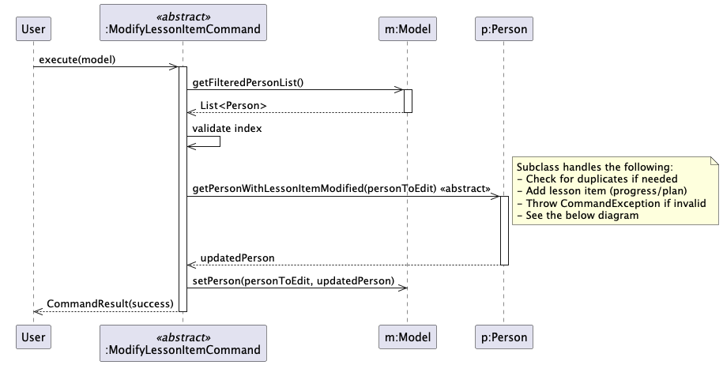
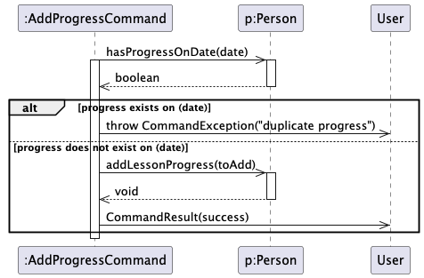
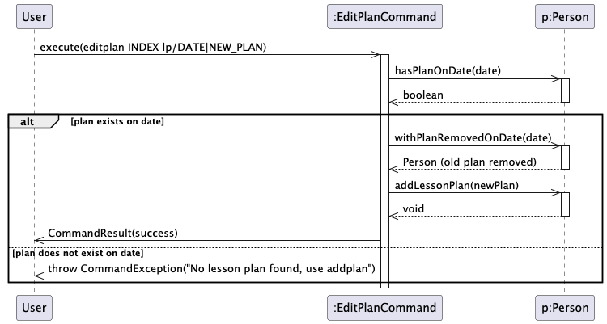
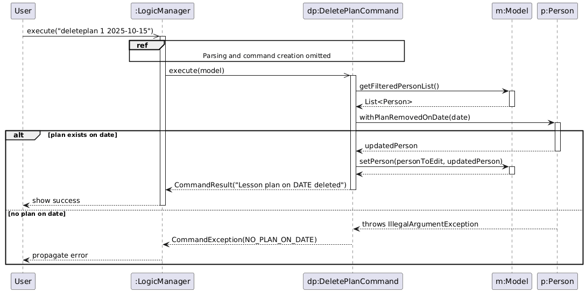
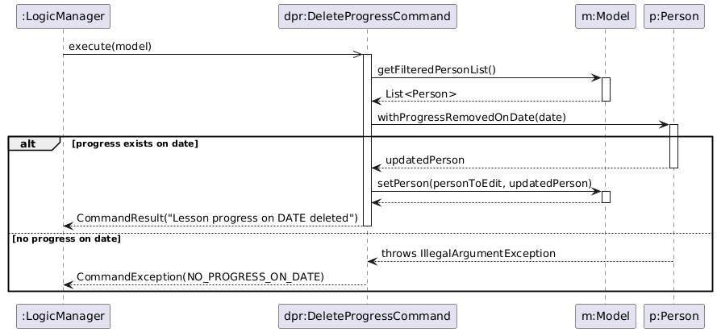
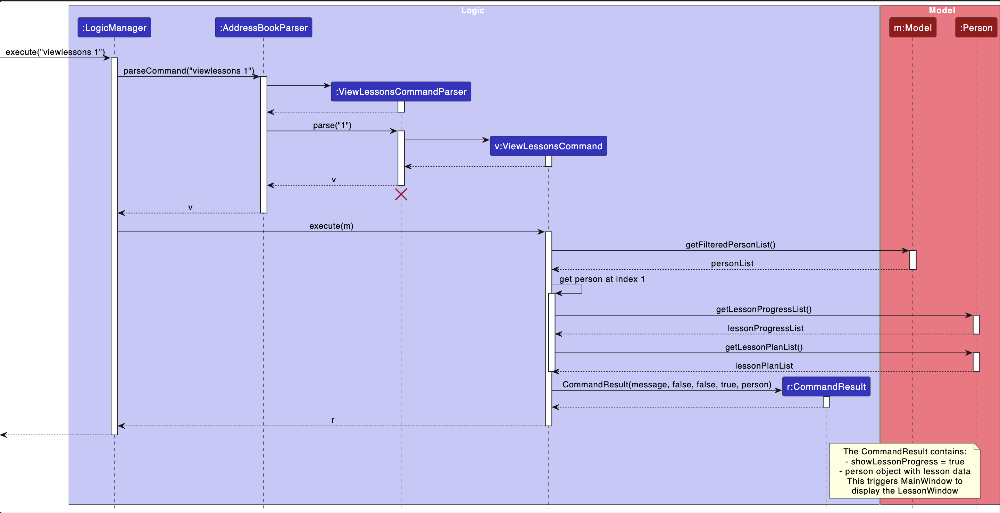
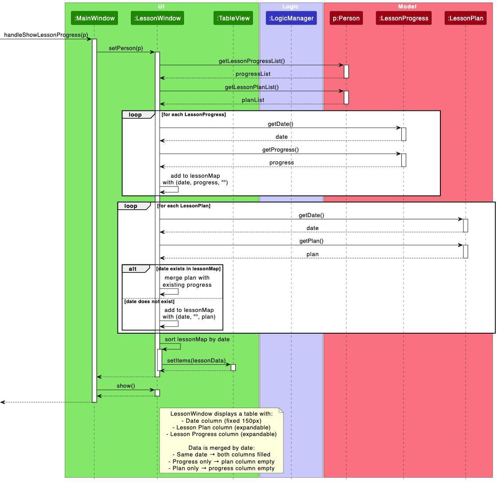

--------------------------------------------------------------------------------------------------------------------

## **Acknowledgements**

* {list here sources of all reused/adapted ideas, code, documentation, and third-party libraries -- include links to the original source as well}

--------------------------------------------------------------------------------------------------------------------

## **Setting up, getting started**

Refer to the guide [_Setting up and getting started_](SettingUp.md).

--------------------------------------------------------------------------------------------------------------------

## **Design**

:bulb: **Tip:** The `.puml` files used to create diagrams are in this document `docs/diagrams` folder. Refer to the [_PlantUML Tutorial_ at se-edu/guides](https://se-education.org/guides/tutorials/plantUml.html) to learn how to create and edit diagrams.

### Architecture

The ***Architecture Diagram*** given above explains the high-level design of the App.

Given below is a quick overview of main components and how they interact with each other.

**Main components of the architecture**

**`Main`** (consisting of classes [`Main`](https://github.com/se-edu/addressbook-level3/tree/master/src/main/java/seedu/address/Main.java) and [`MainApp`](https://github.com/se-edu/addressbook-level3/tree/master/src/main/java/seedu/address/MainApp.java)) is in charge of the app launch and shut down.
* At app launch, it initializes the other components in the correct sequence, and connects them up with each other.
* At shut down, it shuts down the other components and invokes cleanup methods where necessary.

The bulk of the app's work is done by the following four components:

* [**`UI`**](#ui-component): The UI of the App.
* [**`Logic`**](#logic-component): The command executor.
* [**`Model`**](#model-component): Holds the data of the App in memory.
* [**`Storage`**](#storage-component): Reads data from, and writes data to, the hard disk.

[**`Commons`**](#common-classes) represents a collection of classes used by multiple other components.

**How the architecture components interact with each other**

The *Sequence Diagram* below shows how the components interact with each other for the scenario where the user issues the command `delete 1`.

Each of the four main components (also shown in the diagram above),

* defines its *API* in an `interface` with the same name as the Component.
* implements its functionality using a concrete `{Component Name}Manager` class (which follows the corresponding API `interface` mentioned in the previous point.

For example, the `Logic` component defines its API in the `Logic.java` interface and implements its functionality using the `LogicManager.java` class which follows the `Logic` interface. Other components interact with a given component through its interface rather than the concrete class (reason: to prevent outside component's being coupled to the implementation of a component), as illustrated in the (partial) class diagram below.

The sections below give more details of each component.

### UI component

The **API** of this component is specified in [`Ui.java`](https://github.com/se-edu/addressbook-level3/tree/master/src/main/java/seedu/address/ui/Ui.java)

The UI consists of a `MainWindow` that is made up of parts e.g.`CommandBox`, `ResultDisplay`, `PersonListPanel`, `StatusBarFooter` etc. All these, including the `MainWindow`, inherit from the abstract `UiPart` class which captures the commonalities between classes that represent parts of the visible GUI.

The `UI` component uses the JavaFx UI framework. The layout of these UI parts are defined in matching `.fxml` files that are in the `src/main/resources/view` folder. For example, the layout of the [`MainWindow`](https://github.com/se-edu/addressbook-level3/tree/master/src/main/java/seedu/address/ui/MainWindow.java) is specified in [`MainWindow.fxml`](https://github.com/se-edu/addressbook-level3/tree/master/src/main/resources/view/MainWindow.fxml)

The `UI` component,

* executes user commands using the `Logic` component.
* listens for changes to `Model` data so that the UI can be updated with the modified data.
* keeps a reference to the `Logic` component, because the `UI` relies on the `Logic` to execute commands.
* depends on some classes in the `Model` component, as it displays `Person` object residing in the `Model`.

### Logic component

**API** : [`Logic.java`](https://github.com/se-edu/addressbook-level3/tree/master/src/main/java/seedu/address/logic/Logic.java)

Here's a (partial) class diagram of the `Logic` component:

The sequence diagram below illustrates the interactions within the `Logic` component, taking `execute("delete 1")` API call as an example.

:information_source: **Note:** The lifeline for `DeleteCommandParser` should end at the destroy marker (X) but due to a limitation of PlantUML, the lifeline continues till the end of diagram.

How the `Logic` component works:

1. When `Logic` is called upon to execute a command, it is passed to an `AddressBookParser` object which in turn creates a parser that matches the command (e.g., `DeleteCommandParser`) and uses it to parse the command.
1. This results in a `Command` object (more precisely, an object of one of its subclasses e.g., `DeleteCommand`) which is executed by the `LogicManager`.
1. The command can communicate with the `Model` when it is executed (e.g. to delete a person). 
   Note that although this is shown as a single step in the diagram above (for simplicity), in the code it can take several interactions (between the command object and the `Model`) to achieve.
1. The result of the command execution is encapsulated as a `CommandResult` object which is returned back from `Logic`.

Here are the other classes in `Logic` (omitted from the class diagram above) that are used for parsing a user command:

How the parsing works:
* When called upon to parse a user command, the `AddressBookParser` class creates an `XYZCommandParser` (`XYZ` is a placeholder for the specific command name e.g., `AddCommandParser`) which uses the other classes shown above to parse the user command and create a `XYZCommand` object (e.g., `AddCommand`) which the `AddressBookParser` returns back as a `Command` object.
* All `XYZCommandParser` classes (e.g., `AddCommandParser`, `DeleteCommandParser`, ...) inherit from the `Parser` interface so that they can be treated similarly where possible e.g, during testing.

### Model component
**API** : [`Model.java`](https://github.com/se-edu/addressbook-level3/tree/master/src/main/java/seedu/address/model/Model.java)

The `Model` component,

* stores the address book data i.e., all `Person` objects (which are contained in a `UniquePersonList` object).
* stores the currently 'selected' `Person` objects (e.g., results of a search query) as a separate _filtered_ list which is exposed to outsiders as an unmodifiable `ObservableList<Person>` that can be 'observed' e.g. the UI can be bound to this list so that the UI automatically updates when the data in the list change.
* stores a `UserPref` object that represents the user’s preferences. This is exposed to the outside as a `ReadOnlyUserPref` objects.
* does not depend on any of the other three components (as the `Model` represents data entities of the domain, they should make sense on their own without depending on other components)

:information_source: **Note:** An alternative (arguably, a more OOP) model is given below. It has a `Tag` list in the `AddressBook`, which `Person` references. This allows `AddressBook` to only require one `Tag` object per unique tag, instead of each `Person` needing their own `Tag` objects. 

### Storage component

**API** : [`Storage.java`](https://github.com/se-edu/addressbook-level3/tree/master/src/main/java/seedu/address/storage/Storage.java)

The `Storage` component,
* can save both address book data and user preference data in JSON format, and read them back into corresponding objects.
* inherits from both `AddressBookStorage` and `UserPrefStorage`, which means it can be treated as either one (if only the functionality of only one is needed).
* depends on some classes in the `Model` component (because the `Storage` component's job is to save/retrieve objects that belong to the `Model`)

### Common classes

Classes used by multiple components are in the `seedu.address.commons` package.

--------------------------------------------------------------------------------------------------------------------

## **Implementation**

This section describes some noteworthy details on how certain features are implemented.

### Find feature

The find feature allows users to search for persons by name (default), tags (with `t/` prefix), or lesson day (with `d/` prefix).

#### Implementation

The find mechanism is implemented using predicates and comparators:
* `NameContainsKeywordsPredicate` - filters persons whose names match the keywords using prefix matching
* `TagContainsKeywordsPredicate` - filters persons whose tags match the keywords using full-word matching
* `LessonDayPredicate` - filters persons whose lesson day matches the specified day

The `FindCommandParser` detects the presence of prefixes using `ArgumentTokenizer`:
* If `d/` prefix is present, it validates the day using `ParserUtil.parseDay()`, then creates a `FindCommand` with `LessonDayPredicate` and its time-based comparator
* If `t/` prefix is present, it creates a `FindCommand` with `TagContainsKeywordsPredicate` (no sorting)
* If no prefix is present, it creates a `FindCommand` with `NameContainsKeywordsPredicate` and its relevance-based comparator

**Day Validation:**
* `ParserUtil.parseDay()` validates that the input is one of the seven days of the week
* Uses regex pattern matching for case-insensitive validation
* Rejects abbreviations (e.g., "Mon"), typos (e.g., "Mondayy"), and invalid inputs (e.g., "Tomorrow", "1")
* Error message stored in `Messages.MESSAGE_INVALID_DAY` for consistent user-facing messaging

**Search Types:**

1. **Prefix Matching (Name Search):**
   * Uses `StringUtil.containsPrefixIgnoreCase()` to check if any word token starts with the search keyword
   * Enables partial name matching (e.g "Jo" matches "John")
   * Results are ranked by relevance (see below)

2. **Full-word Matching (Tag Search):**
   * Matches complete tag names only
   * Case-insensitive
   * No sorting applied

3. **Day Matching (Lesson Day Search):**
   * Filters by the day component of `DayTime` field (e.g., "Monday 1200" → "Monday")
   * **Validation:** Only accepts full day names (Monday, Tuesday, Wednesday, Thursday, Friday, Saturday, Sunday). Invalid days trigger a `ParseException` with the message `MESSAGE_INVALID_DAY`
   * Validation is performed by `ParserUtil.parseDay()` which uses regex matching: `(?i)^(Monday|Tuesday|Wednesday|Thursday|Friday|Saturday|Sunday)$`
   * Case-insensitive (e.g., "monday", "Monday", "MONDAY" all match)
   * **Important:** Time is used for sorting only, not for filtering
   * Results are automatically sorted by lesson time (earliest to latest)

**Ranking System for Name Search:**
Search results are ranked by relevance using a comparator returned by `NameContainsKeywordsPredicate.getComparator()`:
1. **Rank 1** (Highest): First name token matches (e.g., "John Doe" for query "Jo")
2. **Rank 2**: Other name tokens match (e.g., "Mary Joe" for query "Jo")
3. **Alphabetical**: Tiebreaker for same-rank results

**Sorting System for Day Search:**
Search results are sorted chronologically using a comparator returned by `LessonDayPredicate.getComparator()`:
1. **Primary sort**: Lesson time in ascending order (0900 before 1400)
2. **Secondary sort**: Alphabetical by name (case-insensitive) when timing are equal

The ranking is implemented using JavaFX's `SortedList` wrapper:
* `ModelManager` wraps the `FilteredList` with a `SortedList`
* When `FindCommand.execute()` is called with a comparator, it uses `Model.updateFilteredPersonList(predicate, comparator)`
* When other commands (e.g., `list`, `edit`) call `Model.updateFilteredPersonList(predicate)`, the sorting is cleared

This approach ensures:
- Search results appear in order of relevance (name) or chronologically (day)
- Sorting is temporary and specific to the current search
- Other commands maintain the original contact order

#### Design Considerations for Name Search Matching Strategy

**Aspect: How to match search keywords against person names**

* **Alternative 1: Exact Prefix Matching (Substring Match on Full Name)**
  * Implementation: Treat the entire name as a single string and check if it starts with the search keyword
  * Example: For name "John David Smith"
    - `find john` results in a Match (name starts with "John")
    - `find david` results in No match (name doesn't start with "David")
    - `find smith` results in No match (name doesn't start with "Smith")
  * Pros: 
    - Simpler implementation (no tokenization required)
    - Faster performance (single string comparison)
  * Cons: 
    - **Cannot search by last name** - Critical limitation for busy tutors who cannot remember their students by their first name
    - **Poor user experience** - Breaks mental model from common contact apps (phone, Gmail, etc.)
    - **Less flexible** - Only searches the beginning of the full name string
    - **Unusable for Asian naming conventions** - Cannot find "Tan Wei Ming" by searching "tan" or "ming"

* **Alternative 2 (Current choice): Token-Based Prefix Matching**
  * Implementation: Split name into tokens (words) and check if any token starts with the search keyword
  * Example: For name "John David Smith" → tokens ["John", "David", "Smith"]
    - `find john` leads to a match (1st token "John" starts with "john")
    - `find david` leads to a match (2nd token "David" starts with "david")
    - `find smith` leads to a match (3rd token "Smith" starts with "smith")
  * Pros: 
    - **Can search by any name part** - Users can find students by first, middle, or last name
    - **Aligns with user expectations** - Matches behavior of mainstream contact apps
    - **Practical for tutors** - Often remember students by last name or nickname
  * Cons: 
    - More complex implementation (requires tokenization and multiple comparisons)
    - Requires ranking system to prioritize first name matches

**Rationale:** 
Alternative 2 was chosen because **searching by last name is essential functionality** for a tutor contact management system. Tutors frequently have multiple students from the same family (e.g., siblings "Alice Tan" and "Bobby Tan") and need to search by family name. The token-based approach also aligns with user expectations from familiar contact applications, reducing the learning curve. While more complex to implement, the usability benefits far outweigh the implementation cost.

#### Error Handling for Empty Search Results

When a search returns no matches, the find feature handles it gracefully:

1. **Validation Before Mutation**: `FindCommand.execute()` validates that at least one match exists before applying the filter to the list.
2. **Pre-check Implementation**: Uses Java streams to count matches: `filteredList.stream().filter(searchPredicate).count()`
3. **Error on Zero Matches**: If count is 0, throws `CommandException` with message: "Contact list is unchanged: No students match your search criteria."
4. **Preserved State**: The filtered list remains unchanged when the exception is thrown
5. **UX Benefits**:
   - The command text stays in the command box (with red border) for easy editing and retry
   - Users don't lose their current view when a search fails
   - Clear feedback distinguishes between successful empty results and failed searches

This follows the **validate-before-mutate** pattern used throughout the codebase (e.g., `DeleteCommand` validates index before deletion).

#### Example Usage Scenario

Given below is an example usage scenario of the find feature with ranking:

Step 1. The user launches the application. The `ModelManager` initializes with a `FilteredList` wrapped in a `SortedList` with no comparator set (no sorting).

Step 2. The user executes `find Jo` to search for persons whose names start with "Jo". The `FindCommandParser` parses this and creates a `NameContainsKeywordsPredicate` with keyword "Jo", then creates a `FindCommand` with both the predicate and the predicate's comparator.

Step 3. `FindCommand.execute()` calls `model.updateFilteredPersonList(predicate, comparator)`, which:
   * Sets the predicate on the `FilteredList` (filters to only matching persons)
   * Sets the comparator on the `SortedList` (sorts the filtered results)

Step 4. The results appear ranked: "John Doe" (first name match) appears before "Mary Joe" (last name match).

Step 5. The user executes `list` to view all persons. `ListCommand.execute()` calls `model.updateFilteredPersonList(PREDICATE_SHOW_ALL_PERSONS)` which clears the comparator, removing the ranking.

### Add Lesson Progress feature

The Add Lesson Progress feature allows tutors to record new lesson progress entries for a specific student, capturing the date and description of what was covered during a lesson.

#### Implementation

The Add Lesson Progress mechanism involves coordination across multiple components:

**Logic Component:**

* AddProgressCommand – Adds a new LessonProgress entry to a specified student.
* AddProgressCommandParser – Parses the student index and lesson progress details from user input.
* Expected format: addprogress INDEX pr/DATE|PROGRESS
* Extracts the DATE and PROGRESS components by splitting the string after the pr/ prefix using the | delimiter.
* Uses ParserUtil.parseIndex() to parse the student index and LocalDate.parse() to validate the date.

**Model Component:**

* Person – Contains a List<LessonProgress> representing all past lesson progress entries.
* LessonProgress – Stores two fields: LocalDate date and String description.
* The AddProgressCommand retrieves the target Person, creates a new LessonProgress object, and appends it to the person’s lesson progress list.
* A new Person object is created with the updated lesson progress list (immutability principle), replacing the original person in the model.

**Storage Component:**

* JsonAdaptedLessonProgress – Handles JSON serialization and deserialization of LessonProgress data when saving or loading from storage.
* Each LessonProgress entry is stored as an object with date and progress fields in the JSON file.

**UI Component:**

* The result of a successful `addprogress` command is displayed in the Result Display panel.
* The updated progress list can then be viewed using the `viewlessons` command, which opens the LessonProgressWindow.

**Notes:**
The sequence diagram above focuses on the runtime behavior of AddProgressCommand.execute() and its interactions with `Model`, `Person`, and `LessonProgress`.
Classes such as `AddProgressCommandParser`, `ParserUtil`, and `LocalDate` are not included because they handle input parsing and validation before execution and are considered utility or library components.
This keeps the diagram concise and highlights the key object interactions for adding a lesson progress entry.

**Example Usage Scenario**

Given below is an example usage scenario of the Add Lesson Progress feature:

Step 1. The user executes `addprogress 1 pr/2025-10-21|Introduced new algebra concepts` to add a progress entry for the 1st student.

Step 2. `AddProgressCommandParser` parses:

Index = 1

Date = 2025-10-21

Progress = "Introduced new algebra concepts"

Step 3. `AddProgressCommandParser` creates a new `LessonProgress` object with the parsed values and constructs an `AddProgressCommand` with the index and lesson progress.

Step 4. `AddProgressCommand.execute()` retrieves the student at index 1 from the filtered person list in the model.

Step 5. The command creates a new Person with the additional lesson progress entry appended to their existing list of progress records.

Step 6. `Model.setPerson(targetPerson, updatedPerson)` is called to update the model with the modified person.

Step 7. The command returns a `CommandResult` confirming the addition, e.g.
New lesson progress added for Alex Yeoh: [2025-10-21] Introduced new algebra concepts

Step 8. The user may then execute `viewlessons 1` to view the updated list of progress entries in the Lesson Progress window.

### Edit Lesson Plan/Progress Feature
**Notes:**
The Edit Lesson Plan and Edit Lesson Progress features allow a tutor to modify an existing lesson entry for a specific student on a specific date. The implementation for editplan and editprogress is similar. Therefore, this guide will use editplan as an example.

#### Implementation

**Logic Component:**

* EditPlanCommand – Edits an existing `LessonPlan` entry for a specified student.
* EditPlanCommandParser – Parses the student index and new lesson plan details from user input.
* Expected format: `editplan INDEX lp/DATE|NEW_PLAN`
* The parser extracts the DATE and NEW_PLAN components by splitting the string after the `lp/` prefix using the `|` delimiter.
* Uses `ParserUtil.parseIndex()` to parse the student index and `LocalDate.parse()` to validate the date.
* Constructs an `EditPlanCommand` with the parsed index and updated `LessonPlan`.

**Model Component:**

* Person – Contains a `List<LessonPlan>` representing all planned lessons for a student.
* LessonPlan – Stores two fields: `LocalDate date` and `String plan`.

**Storage Component:**

* JsonAdaptedLessonPlan – Handles JSON serialization and deserialization of `LessonPlan` data.
* Each lesson plan entry is stored as a JSON object with two fields: `date` and `plan`.
* When a plan is edited, the updated entry replaces the old one upon saving.

**UI Component:**
* The result of a successful `editplan` command is shown in the **Result Display** panel.
* The updated plan list can be viewed using the `viewlessons` command, which opens the LessonPlanWindow to display the current plans.

## Example Usage Scenario

Below is an example scenario for the Edit Lesson Plan feature:

**Step 1.**
The user executes:
editplan 1 lp/2025-10-15|Cover Chapter 6
**Step 2.**
`EditPlanCommandParser` parses:
Index = 1
Date = 2025-10-15
New Plan = "Cover Chapter 6"
**Step 3.**
The parser constructs a new `LessonPlan` with the parsed data and creates an `EditPlanCommand`.
**Step 4.**
`EditPlanCommand.execute()` retrieves the student at index `1` from the filtered person list.
**Step 5.**
The command verifies that a lesson plan exists on the given date.
If found, it removes the old plan and adds the new one.
**Step 6.**
`Model.setPerson(targetPerson, updatedPerson)` updates the model with the modified student.
**Step 7.**
A `CommandResult` is returned confirming the edit, e.g. Lesson plan on 2025-10-15 updated: Cover Chapter 6
**Step 8.**
The user may execute `viewlessons 1` to view the updated list of lesson plans in the Lesson Plan window.

### Delete Lesson Plan Feature

#### Implementation

The delete lesson plan feature removes a specific lesson plan (by date) for a selected student. The command validates the person index, delegates deletion-and-validation to `Person.withPlanRemovedOnDate(date)`, and updates the model with an immutable `Person` copy. The diagram below shows a user-triggered flow from `User` → `LogicManager` → `DeletePlanCommand` to `Model`/`Person`. Parsing and command creation are intentionally omitted using a `ref` frame to reduce clutter.

Key points:
- `DeletePlanCommandParser` parses `INDEX` and `DATE` using `ParserUtil.parseIndexAndDate(...)` (omitted in the diagram via `ref`).
- `DeletePlanCommand.execute(model)` gets the filtered list, validates the index, asks `Person` to produce an updated copy via `withPlanRemovedOnDate(date)`, and calls `Model#setPerson(...)`.
- On success, a `CommandResult("Lesson plan on DATE deleted")` is returned to `LogicManager` and then surfaced to the user. If no plan exists on the given date, `Person` throws `IllegalArgumentException`; the command maps it to a user-facing `CommandException`.

#### Design considerations

- Validation placement (Tell, Don't Ask): `Person.withPlanRemovedOnDate(date)` performs the existence check and throws `IllegalArgumentException` if not found. The command simply maps exceptions to user-facing `CommandException`, keeping validation close to the domain model.
- Template Method reuse: Both delete commands extend `DeleteLessonItemCommand` and override `createPersonWithItemRemoved(Person, LocalDate)` to inject item-specific behavior. This avoids duplication of index validation, model access, and result formatting.
- Immutability: Instead of mutating the same `Person` instance, `Person` returns a new copy with the plan removed. The model is updated via `Model#setPerson(target, updated)`, improving safety and testability.

#### Constraints and invariants

- Each student has at most one plan per date. This invariant is enforced by add/edit paths and delete assumes it.

#### Storage & persistence

- The address book is saved only after successful execution (within `LogicManager.execute`). Failures (exceptions) do not trigger persistence.

### Delete Lesson Progress Feature

#### Implementation

The delete lesson progress feature mirrors delete plan, but targets progress entries. The sequence diagram below starts at `LogicManager -> DeleteProgressCommand` (parsing omitted using a reference frame) and focuses on command execution and model update.

Key points:
- `DeleteProgressCommand.execute(model)` retrieves the target `Person`, calls `Person.withProgressRemovedOnDate(date)`, and updates the model with the returned copy.
- Absence of a progress entry on that date results in an `IllegalArgumentException` inside `Person`, mapped to `CommandException` by the command.

#### Design considerations

- Validation in model: `Person.withProgressRemovedOnDate(date)` ensures the progress exists and signals failure via `IllegalArgumentException`; the command translates that to a `CommandException` with a user-friendly message.
- Template Method reuse: Shares the same superclass `DeleteLessonItemCommand` (index validation, model access, result creation) and only overrides the item-specific removal method.
- Immutability: Produces an updated `Person` copy and replaces it in the model with `Model#setPerson(...)`.

#### Constraints and invariants

- Each student has at most one progress per date. This invariant is enforced by add/edit paths and delete assumes it.

#### Storage & persistence

- Persistence occurs on success only; exceptions prevent save. This keeps on-disk state consistent with in-memory state.

### View Lessons feature

The View Lessons feature allows tutors to view a student's lesson progress and lesson plans in a unified popup window. The window displays a table with three columns: Date, Lesson Plan, and Lesson Progress. Records from both progress and plans are merged by date, showing a comprehensive view of all lessons.

#### Implementation

The View Lessons mechanism involves coordination across multiple components:

**Logic Component:**
* `ViewLessonsCommand` - Retrieves the specified person from the model and returns them in the `CommandResult` with the command word `viewlessons`
* `ViewLessonsCommandParser` - Parses the student index from user input using `ParserUtil.parseIndex()`

**UI Component:**
* `LessonWindow` - A popup window that displays lesson progress and plans in a unified TableView with three columns:
  * Date column (fixed width 150px)
  * Lesson Plan column (expandable, equal width with Progress)
  * Lesson Progress column (expandable, equal width with Plan)
* `LessonDisplay` - A view model class that combines `LessonProgress` and `LessonPlan` for the same date, used to populate the table
* `MainWindow` - Handles the command result and passes the person data to the popup window

**Model Component:**
* `Person` - Contains two lists: `List<LessonProgress>` and `List<LessonPlan>`
* `LessonProgress` - Stores the date and progress description for each lesson
* `LessonPlan` - Stores the date and lesson plan description

**Storage Component:**
* `JsonAdaptedLessonProgress` - Handles JSON serialization/deserialization of lesson progress data
* `JsonAdaptedLessonPlan` - Handles JSON serialization/deserialization of lesson plan data

**Sequence of Operations:**

The following sequence diagram shows how a `viewlessons` command is executed through the Logic component:

:information_source: **Note:** The lifeline for `ViewLessonsCommandParser` should end at the destroy marker (X) but due to a limitation of PlantUML, the lifeline continues till the end of diagram.

The following sequence diagram shows how the UI component handles displaying the lesson window:

**Data Merging Logic:**

The `LessonWindow.setPerson()` method implements the merging logic:
1. Creates a `HashMap<LocalDate, LessonDisplay>` to combine entries by date
2. Iterates through all `LessonProgress` entries and adds them to the map
3. Iterates through all `LessonPlan` entries:
   * If the date already exists (has progress), merges the plan with existing progress
   * If the date is new, creates a new entry with empty progress
4. Converts the map to a sorted list (chronological order by date)
5. Populates the TableView with the merged data

**Text Wrapping:**

The Lesson Plan and Lesson Progress columns use custom cell factories to enable text wrapping:
* `configureWrappingColumn()` creates `TableCell` instances with `Text` nodes
* The wrapping width is bound to the column width, ensuring text wraps dynamically when columns resize
* Row height automatically adjusts to fit wrapped text content

Given below is an example usage scenario:

Step 1. The user executes `viewlessons 1` to view the lessons for the 1st student in the list.

Step 2. `ViewLessonsCommandParser` parses the index "1" and creates a `ViewLessonsCommand` with index 1.

Step 3. `ViewLessonsCommand` executes and retrieves the person at index 1 from the filtered person list in the model.

Step 4. The command returns a `CommandResult` containing the person object.

Step 5. `MainWindow` receives the `CommandResult` and extracts the person using `getPerson()`.

Step 6. `MainWindow` calls `handleShowLessonProgress(person)` to display the lesson window.

Step 7. `LessonWindow` receives the person via `setPerson(person)` and:
   * Merges lesson progress and lesson plans by date using a HashMap
   * Sorts the merged entries chronologically
   * Populates the TableView with three columns: Date, Lesson Plan, Lesson Progress

Step 8. The lesson window is displayed to the user showing the merged data in a three-column table.

#### Design considerations

**Aspect: How to pass data from Command to UI**

* **Alternative 1 (current choice):** Add a `Person` field to `CommandResult`
  * Pros: Clean separation of concerns - the command returns domain data, and the UI decides how to display it
  * Pros: Reusable pattern for other commands that need to pass data to UI
  * Cons: Requires modification to the `CommandResult` class

* **Alternative 2:** Store the person in the Model and have UI retrieve it
  * Pros: Doesn't require changes to `CommandResult`
  * Cons: Creates tight coupling between UI and Model
  * Cons: Requires additional state management in Model

**Aspect: How to merge lesson progress and plans**

* **Alternative 1 (current choice):** Use HashMap to merge by date in UI layer
  * Pros: UI has full control over display logic
  * Pros: Model remains simple with separate lists
  * Pros: Easy to display entries that have only progress or only plan
  * Cons: Merging logic is in UI instead of Model

* **Alternative 2:** Store merged lessons in Model
  * Pros: Model handles data transformation
  * Cons: More complex model with additional data structures
  * Cons: Harder to maintain separate progress/plan operations (e.g., addprogress, addplan)

**Aspect: How to display data in TableView**

* **Alternative 1 (current choice):** Create LessonDisplay view model
  * Pros: Separates UI representation from domain model
  * Pros: JavaFX properties enable easy binding to TableView
  * Pros: Can combine multiple domain objects (Progress + Plan) into one display row
  * Cons: Additional class to maintain

* **Alternative 2:** Display LessonProgress and LessonPlan directly
  * Pros: No intermediate class needed
  * Cons: Cannot easily merge progress and plan for same date
  * Cons: Would need two separate tables or duplicate dates

### \[Proposed\] Undo/redo feature

#### Proposed Implementation

The proposed undo/redo mechanism is facilitated by `VersionedAddressBook`. It extends `AddressBook` with an undo/redo history, stored internally as an `addressBookStateList` and `currentStatePointer`. Additionally, it implements the following operations:

* `VersionedAddressBook#commit()` — Saves the current address book state in its history.
* `VersionedAddressBook#undo()` — Restores the previous address book state from its history.
* `VersionedAddressBook#redo()` — Restores a previously undone address book state from its history.

These operations are exposed in the `Model` interface as `Model#commitAddressBook()`, `Model#undoAddressBook()` and `Model#redoAddressBook()` respectively.

Given below is an example usage scenario and how the undo/redo mechanism behaves at each step.

Step 1. The user launches the application for the first time. The `VersionedAddressBook` will be initialized with the initial address book state, and the `currentStatePointer` pointing to that single address book state.

Step 2. The user executes `delete 5` command to delete the 5th person in the address book. The `delete` command calls `Model#commitAddressBook()`, causing the modified state of the address book after the `delete 5` command executes to be saved in the `addressBookStateList`, and the `currentStatePointer` is shifted to the newly inserted address book state.

Step 3. The user executes `add n/David …​` to add a new person. The `add` command also calls `Model#commitAddressBook()`, causing another modified address book state to be saved into the `addressBookStateList`.

:information_source: **Note:** If a command fails its execution, it will not call `Model#commitAddressBook()`, so the address book state will not be saved into the `addressBookStateList`.

Step 4. The user now decides that adding the person was a mistake, and decides to undo that action by executing the `undo` command. The `undo` command will call `Model#undoAddressBook()`, which will shift the `currentStatePointer` once to the left, pointing it to the previous address book state, and restores the address book to that state.

:information_source: **Note:** If the `currentStatePointer` is at index 0, pointing to the initial AddressBook state, then there are no previous AddressBook states to restore. The `undo` command uses `Model#canUndoAddressBook()` to check if this is the case. If so, it will return an error to the user rather
than attempting to perform the undo.

The following sequence diagram shows how an undo operation goes through the `Logic` component:

:information_source: **Note:** The lifeline for `UndoCommand` should end at the destroy marker (X) but due to a limitation of PlantUML, the lifeline reaches the end of diagram.

Similarly, how an undo operation goes through the `Model` component is shown below:

The `redo` command does the opposite — it calls `Model#redoAddressBook()`, which shifts the `currentStatePointer` once to the right, pointing to the previously undone state, and restores the address book to that state.

:information_source: **Note:** If the `currentStatePointer` is at index `addressBookStateList.size() - 1`, pointing to the latest address book state, then there are no undone AddressBook states to restore. The `redo` command uses `Model#canRedoAddressBook()` to check if this is the case. If so, it will return an error to the user rather than attempting to perform the redo.

Step 5. The user then decides to execute the command `list`. Commands that do not modify the address book, such as `list`, will usually not call `Model#commitAddressBook()`, `Model#undoAddressBook()` or `Model#redoAddressBook()`. Thus, the `addressBookStateList` remains unchanged.

Step 6. The user executes `clear`, which calls `Model#commitAddressBook()`. Since the `currentStatePointer` is not pointing at the end of the `addressBookStateList`, all address book states after the `currentStatePointer` will be purged. Reason: It no longer makes sense to redo the `add n/David …​` command. This is the behavior that most modern desktop applications follow.

The following activity diagram summarizes what happens when a user executes a new command:

#### Design considerations:

**Aspect: How undo & redo executes:**

* **Alternative 1 (current choice):** Saves the entire address book.
  * Pros: Easy to implement.
  * Cons: May have performance issues in terms of memory usage.

* **Alternative 2:** Individual command knows how to undo/redo by
  itself.
  * Pros: Will use less memory (e.g. for `delete`, just save the person being deleted).
  * Cons: We must ensure that the implementation of each individual command are correct.

_{more aspects and alternatives to be added}_

### \[Proposed\] Data archiving

_{Explain here how the data archiving feature will be implemented}_

--------------------------------------------------------------------------------------------------------------------

## **Documentation, logging, testing, configuration, dev-ops**

* [Documentation guide](Documentation.md)
* [Testing guide](Testing.md)
* [Logging guide](Logging.md)
* [Configuration guide](Configuration.md)
* [DevOps guide](DevOps.md)

--------------------------------------------------------------------------------------------------------------------

## **Appendix: Requirements**

### Product scope

**Target user profile**:

* is a private tutor managing 20 or more students across different subjects
* needs to track lesson progress, assignments, and parent communication efficiently
* prefers desktop apps that centralize student information in one place
* can type reasonably fast and is comfortable with CLI-based apps
* values speed and organization over visual-heavy interfaces
* often has limited time for admin work and prefers tools that reduce repetitive tracking tasks

**Value proposition**: TutorTrack is a centralised tool to manage lesson plans, assignments, deadlines and learning progress based on student contacts in one streamlined system. Built for tutors with many students, TutorTrack helps reduce time spent on administrative tasks and simplifies preparation of progress updates for parents. With that, tutors are empowered to focus on what matters most – marking, giving feedback, and creating target resources for students.

### User stories

Priorities: High (must have) - `* * *`, Medium (nice to have) - `* *`, Low (unlikely to have) - `*`

| Priority | As a …​ | I want to …​                                                       | So that I can…​                                                |
|----------|---------|--------------------------------------------------------------------|----------------------------------------------------------------|
| `* * *`  | new tutor | quickly add my students' contact information | reach out to them or their parents without delay |
| `* * *`  | experienced tutor | view all my students in one place | recall lesson history and contact details efficiently |
| `* * *`  | tutor managing multiple subjects | filter students by subject | prepare lesson materials faster |
| `* * *`  | tutor | record key points from each lesson | track student progress over time |
| `* * *`  | tutor | search for a student by name | find their contact info or lesson history quickly |
| `* * *`  | tutor | update the content of a planned lesson (by date) | tailor upcoming lessons based on student progress or parent feedback |
| `* * *`  | tutor | view past lesson notes by date | continue lessons seamlessly without re-teaching covered material |
| `* * *`  | tutor working with parents | keep parent contact info alongside student records | communicate updates conveniently |
| `* * *`  | tutor | review a student's overall progress history | identify strengths and areas for improvement |
| `* * *`  | tutor | have a quick overview of today's schedule | prepare efficiently before lessons begin |
| `* * *`  | tutor | get a clear error if I try to add a duplicate student | avoid messy duplicates in my contact list |
| `* *`    | tutor | search students by tags | group and find students with specific characteristics to prepare materials more effectively |
| `* *`    | tutor | find out which students are weaker in which topics | focus my attention on those they need help with |
| `* *`    | tutor | delete outdated student records | keep my contact list clean and relevant |
| `* *`    | tutor | delete an incorrect lesson progress record for a student | keep progress tracking accurate and up to date |
| `* *`    | tutor | edit students’ contact information | maintain accurate records when their details change |
| `* *`    | private home tutor | securely track students addresses | refer to their addresses and know where to travel to |
| `* *`    | tutor | view each student's information | easily access each student's personal details |
| `* *`    | tutor | Filter each student by level | Find my students of the same level quicker |
| `*`    | tutor | keep track of my students exam dates | focus more on the specific topics closer to the date |

*{More to be added}*

### Use cases

(For all use cases below, the **System** is the `TutorTrack` and the **Actor** is the `Tutor`, unless specified otherwise)

**Use case: Add a student contact**

**MSS**

1.  User requests to add a new person with details: name, subject level, day/time, cost, address, at least one contact number, and optional tags.
2.  AddressBook validates all input fields:
    * Name is not empty.
    * SubjectLevel follows the format Level-Subject (Level: alphanumeric, no spaces; Subject: letters only, no spaces or digits).
    * Day/time, cost, and address are valid.
    * At least one contact number (student or next-of-kin) is provided.
3. AddressBook creates a new person entry.
4. AddressBook adds the new person to the list.
5. AddressBook shows a confirmation message that the person has been added:
   "add n/Chong Wei sc/91230000 s/Primary6-Math d/Friday 1100 c/$50 a/123, Jurong St"

   Use case ends.

**Extensions**

* 2a. The student already exists (same name and contact).

    * 2a1. TutorTrack shows error message:
      “This person already exists in the address book”

      Use case ends.

* 2b. One or more mandatory fields are missing (i.e., name, subject level, daytime, address, at least one contact).

    * 2b1. Tutortrack shows error message:
      "Invalid command format!..."

      Use case ends.

* 2c. Invalid mandatory fields input

    * 2c1. Invalid name:
        * Name less than 2 characters:
          * TutorTrack shows error message: 
          "Name is too short. It should be at least 2 characters long."
    * 2c2. Invalid daytime:
        * Wrong daytime format:
          * TutorTrack shows error message: 
          DayTime should be in the format 'Day HHMM', e.g., 'Monday 1200' or 'Tuesday 1600'.
        * Invalid time:
          * TutorTrack shows error message: 
            '2400' is not a valid 24-hour time (HHMM).
    * 2c3. Invalid contact:
        * Empty phone number input:
          * TutorTrack shows error message: 
          Phone number cannot be blank.
          * TutorTrack shows error message: 
          Phone number is too short; it should be at least 3 digits.

*{More to be added}*

**Use case: find a student or a group of students**

**MSS**

1. User requests to list all persons.
2. TutorTrack displays the full list of persons.
3. User enters a find command to locate specific persons by name, subject level, tag, or lesson day.
4. TutorTrack filters the list and displays only the persons matching the given keywords or prefix.

    Use case ends.

**Extensions**

* 2a. The list is empty.

  Use case ends.

* 3a. The user provides an invalid prefix

    * 3a1. TutorTrack shows error message:
      “Contact list is unchanged: No students match your search criteria.”

      Use case ends.

* 3a. The user provides an invalid prefix 

    * 3a1. TutorTrack shows error message:
      “Contact list is unchanged: No students match your search criteria.”

      Use case ends.

* 3b. The user provides a valid prefix but an invalid value.

    * 3b1. TutorTrack shows error message:
      “Contact list is unchanged: No students match your search criteria.”

      Use case ends.
* 3c. No persons match the given search criteria.

    * 3c1. TutorTrack shows error message:
      “Contact list is unchanged: No students match your search criteria.”

      Use case ends.

* 3d. The user provides multiple keywords without prefixes
    * TutorTrack displays all persons whose names match any of the given keywords (OR search).

**Use case: editplan**

**MSS**

1. User requests to list all persons.
2. TutorTrack displays the list of persons.
3. User identifies the student to edit and enters the `editplan INDEX pl/DATE|NEW_PLAN` command.
4. TutorTrack locates the lesson plan entry for the given student and date.
5. TutorTrack updates the lesson plan entry with the new description provided.
6. TutorTrack confirms that the lesson plan has been successfully updated.

    Use case ends.

**Extensions**

* 2a. The list is empty.

    Use case ends.

* 3a. The given `INDEX` is invalid (e.g., not a positive integer or out of range).

    * 2a1. TutorTrack shows error message: 
      "The person index provided is invalid."

      Use case resumes at step 2.

* 3b. The `DATE` provided is in the wrong format (e.g., 2025/10/28, 28-10-2025).

    * 2b1. TutorTrack shows error message: 
      * TutorTrack displays an error message: 
      "Invalid date format. Use yyyy-MM-dd (e.g., 2025-10-15)."

      Use case resumes at step 2.
* 3c. The student does not have a lesson plan entry on the specified `DATE`.

    * 3c1. TutorTrack shows error message:
      “No lesson plan found on `DATE`. You might want to use 'addplan' instead.”

      Use case ends.
* 3d. The `NEW_PLAN` field is empty or contains only whitespace.

    * 3d1. TutorTrack shows error message:
      “Plan cannot be empty.”

      Use case resumes at step 2.

*{More to be added}*

### Non-Functional Requirements

1. Should work on any _mainstream OS_ as long as it has Java `17` or above installed.
2. Should be able to hold up to 1000 persons without a noticeable sluggishness in performance for typical usage.
3. A user with above average typing speed for regular English text (i.e. not code, not system admin commands) should be able to accomplish most of the tasks faster using commands than using the mouse.
4. Should start up within 3 seconds on a modern computer.
5. The system should be able to run offline without requiring an internet connection.
6. The system should support standard keyboard shortcuts (e.g., Ctrl+C, Ctrl+V for copy/paste) to improve usability.
7. The system shall handle invalid inputs gracefully (e.g. show error messages without crashing).
8. The system source code should try to adhere to coding standards given by https://se-education.org/guides/conventions/java/intermediate.html for maintainability
9. The application should automatically persist all contact changes and reload them on application startup so that no contacts are lost across sessions
10. Commands should complete within 2 seconds for typical operations
11. UI should remain responsive during all operations (no freezing)

*{More to be added}*

### Glossary

* **Mainstream OS**: Windows, Linux, Unix, MacOS
* **Private contact detail**: A contact detail that is not meant to be shared with others
* **AddressBook**: The in-memory data model that stores contacts as `Person` objects.
* **CLI (Command Line Interface)**: Primary interaction mode where users type commands to carry out actions
* **JavaFX**: A Java toolkit for building client applications with support for FXML layouts and CSS styling used for the AddressBook UI.
* **FXML**: XML layout files (e.g., MainWindow.fxml) that define JavaFX UI structure loaded by UI classes.
* **JSON**: Javascript object notation, a lightweight text format for structured data, used to save and load the address book and user preferences.
* **API**: Application Programming Interface is the public contract of a component (e.g., Model) that defines callable methods and expected behavior.
* **JAR (Java Archive)**: Packaged, executable distribution format used to ship the desktop app.
* **PlantUML**: Tool used to create and edit UML diagrams
* **Prefix**: Command parameter identifiers (eg n/ for name, /p for phone)
* **Command Word**: action keyword at the start of each command (eg add, delete)
* **Index**: the position number of a person in the displayed list, used to reference persons in commands
* **Person**: A contact entity stored in the address book with fields such as name and phone.
* **Tag**: A label attached to a person for categorisation or filtering.
* **Predicate**: A functional interface that tests a condition on a `Person` object, used for filtering the person list.
* **Parser**: Converts raw user input into specific `Command` objects.
* **Command**: An object created by the parser that encapsulates a user action to be executed by `Logic`.
* **CommandResult**: The outcome returned by a `Command` after execution, shown by the UI.
* **Logic**: Component that parses user input, constructs `Command` objects, and coordinates execution.
* **Model**: Component that holds domain data in memory, including user preferences.
* **Storage**: Component that reads and writes persisted data on disk.
* **UI**: Component that renders the application window and visuals using JavaFX.
* **LogicManager**: Concrete implementation of the Logic interface that parses commands and coordinates execution.
* **ObservableList**: a javaFX list that notifies listeners when its contents change, used to update the UI automatically

--------------------------------------------------------------------------------------------------------------------

## **Appendix: Instructions for manual testing**

Given below are instructions to test the app manually.

:information_source: **Note:** These instructions only provide a starting point for testers to work on;
testers are expected to do more *exploratory* testing.

### Launch and shutdown

1. Initial launch

   1. Download the jar file and copy into an empty folder

   1. Double-click the jar file Expected: Shows the GUI with a set of sample contacts. The window size may not be optimum.

1. Saving window preferences

   1. Resize the window to an optimum size. Move the window to a different location. Close the window.

   1. Re-launch the app by double-clicking the jar file. 
       Expected: The most recent window size and location is retained.

1. _{ more test cases …​ }_

### Deleting a person

1. Deleting a person while all persons are being shown

   1. Prerequisites: List all persons using the `list` command. Multiple persons in the list.

   1. Test case: `delete 1` 
      Expected: First contact is deleted from the list. Details of the deleted contact shown in the status message. Timestamp in the status bar is updated.

   2. Test case: `delete 0` 
      Expected: No person is deleted. Error details shown in the status message. Status bar remains the same.

   3. Other incorrect delete commands to try: `delete`, `delete x`, `...` (where x is larger than the list size) 
      Expected: Similar to previous.

1. _{ more test cases …​ }_

### Adding lesson progress

1. Adding lesson progress for a student
   1. Prerequisites: List all persons using the list command. Multiple persons in the list.
   2. Test case: `addprogress 1 pr/2025-10-21|Introduced new algebra concepts` 
   Expected: A success message is shown in the status message confirming that the lesson progress has been added.
   Example: New lesson progress added for Alex Yeoh: [2025-10-21] Introduced new algebra concepts
   The student’s lesson progress list is updated. Timestamp in the status bar is updated.
   3. Test case: `addprogress 0 pr/2025-10-21|Introduced new algebra concepts` 
   Expected: No lesson progress is added. Error details shown in the status message:
   “Invalid command format! …”. Status bar remains the same.
   4. Test case: `addprogress 1 pr/invalid-date|Introduced new algebra concepts` 
   5. Test case: `addprogress 1 pr/2025-10-21|` 
   Expected: No lesson progress is added. Error details shown in the status message: progress description missing.
   6. Test case: `addprogress x pr/2025-10-21|Introduced new algebra concepts` (where x is larger than the list size) 
   Expected: No lesson progress is added. Error message: "The student index provided is invalid." Status bar remains the same.
   7. Other incorrect `addprogress` commands to try: `addprogress`, `addprogress 1`, `addprogress -1 pr/2025-10-21|Concepts`, `addprogress abc lp/2025-10-21|Concepts` 
   Expected: Similar error messages about invalid command format or index.

2. Viewing after addition
      1. Prerequisites: Successfully add at least one lesson progress record to a student.
   2. Test case: viewlessons 1 
   Expected: Popup window appears showing the newly added lesson progress entry in the table under "Date" and "Remarks" columns.

3. { more test cases … }

### Viewing lessons

1. Viewing lessons for a student

   1. Prerequisites: List all persons using the `list` command. Multiple persons in the list. At least one person has lesson progress or lesson plan records.

   1. Test case: `viewlessons 1` 
      Expected: A popup window appears showing the lessons for the 1st student. The window displays a table with three columns: "Date", "Lesson Plan", and "Lesson Progress". If the student has lesson progress/plan records, they are shown merged by date in the table. Success message shown in the status message: "Opened lesson summary window for [Student Name]."

   2. Test case: `viewlessons 0` 
      Expected: No window is shown. Error details shown in the status message: "Invalid command format! ...". Status bar remains the same.

   3. Test case: `viewlessons` 
      Expected: Similar to previous - error message about invalid command format.

   4. Test case: `viewlessons x` (where x is larger than the list size) 
      Expected: No window is shown. Error message: "The student index provided is invalid."

   5. Other incorrect viewlessons commands to try: `viewlessons -1`, `viewlessons abc` 
      Expected: Similar error messages about invalid format or index.

1. Viewing lessons when student has both progress and plans

   1. Prerequisites: Ensure a student in the list has both lesson progress and lesson plans, some on the same dates and some on different dates.

   2. Test case: `viewlessons 1` (assuming 1st student has mixed records) 
      Expected: Popup window shows:
      * Dates with both progress and plan display both in the same row
      * Dates with only progress show progress with empty plan column
      * Dates with only plan show plan with empty progress column
      * All entries sorted chronologically by date

1. Viewing lessons when student has no records

   1. Prerequisites: Ensure a student in the list has no lesson progress or lesson plan records (newly added student).

   2. Test case: `viewlessons 1` (assuming 1st student has no lesson records) 
      Expected: Popup window appears but the table is empty. Success message shown: "Opened lesson summary window for [Student Name]."

1. Text wrapping in lesson window

   1. Prerequisites: Add a student with very long lesson progress or plan text (e.g., 200+ characters).

   2. Test case: `viewlessons 1` (student with long text) 
      Expected: Popup window displays the long text wrapped across multiple lines in the cell. Row height automatically adjusts to fit all text. No text is cut off with ellipsis (...).

   3. Test case: Resize the lesson window wider or narrower 
      Expected: Text in Lesson Plan and Lesson Progress columns dynamically re-wraps to fit the new column width. Date column remains fixed at 150px.

### Deleting lesson plan

1. Deleting a lesson plan for a student

   1. Prerequisites: List all persons using the `list` command. Multiple persons in the list. At least one person has lesson plan records.

   2. Test case: `deleteplan 1 2025-10-15` 
      Expected: Assuming the lesson plan on the specific date for the 1st student exists. The lesson plan on 2025-10-15 for the 1st student is deleted. Success message shown: "Lesson plan on 2025-10-15 deleted".

   3. Test case: `deleteplan 1 2025-12-31` (assuming no plan exists on
      this date) 
      Expected: No lesson plan is deleted. Error message shown: "No lesson plan found on 2025-12-31 for this student".

   4. Test case: `deleteplan 0 2025-10-15` 
      Expected: No lesson plan is deleted. Error message shown: "Invalid index. Please use a valid number from the displayed list (e.g., 1, 2, 3)." followed by usage information.

   5. Test case: `deleteplan 1` 
      Expected: No lesson plan is deleted. Error details shown in the status message: "Invalid command format! ...".

   6. Test case: `deleteplan 1 invalid-date` 
      Expected: No lesson plan is deleted. Error message: "Invalid date format. Use yyyy-MM-dd (e.g., 2025-10-15)."

   7. Test case: `deleteplan 1 2025-13-20` (invalid month) 
      Expected: No lesson plan is deleted. Error message: "Invalid month: must be between 01 and 12."

   8. Test case: `deleteplan 1 2025-02-31` (invalid day for February) 
      Expected: No lesson plan is deleted. Error message: "Invalid day for the given month. Please check your date."

   9. Test case: `deleteplan 1 2025-04-31` (invalid day for April) 
      Expected: No lesson plan is deleted. Error message: "Invalid day for the given month. Please check your date."

   10. Test case: `deleteplan x 2025-10-15` (where x is larger than the list size) 
       Expected: No lesson plan is deleted. Error message shown: "Invalid index. Please use a valid number from the displayed list (e.g., 1, 2, 3)." followed by usage information.

   11. Other incorrect deleteplan commands to try: `deleteplan`, `deleteplan -1 2025-10-15`, `deleteplan abc 2025-10-15` 
       Expected: `deleteplan` shows "Invalid command format!" (missing arguments). `deleteplan -1 2025-10-15` and `deleteplan abc 2025-10-15` show "Invalid index. Please use a valid number from the displayed list (e.g., 1, 2, 3)." followed by usage information.

### Deleting lesson progress

1. Deleting lesson progress while all persons are being shown

   1. Prerequisites: List all persons using the `list` command. Multiple persons in the list. At least the first person has a lesson progress entry on 2025-10-15.

   2. Test case: `deleteprogress 1 2025-10-15` 
      Expected: Assuming the lesson progress on 2025-10-15 for the 1st student exists. The lesson progress on 2025-10-15 for the 1st student is deleted. Success message shown: "Lesson progress on 2025-10-15 deleted".

   3. Test case: `deleteprogress 1 2025-12-31` (assuming no progress exists on this date) 
      Expected: No lesson progress is deleted. Error message shown: "No lesson progress found on 2025-12-31 for this student".

   4. Test case: `deleteprogress 0 2025-10-15` 
      Expected: No lesson progress is deleted. Error message shown: "Invalid index. Please use a valid number from the displayed list (e.g., 1, 2, 3)." followed by usage information.

   5. Test case: `deleteprogress 1 invalid-date` 
      Expected: No lesson progress is deleted. Error message: "Invalid date format. Use yyyy-MM-dd (e.g., 2025-10-15)."

   6. Test case: `deleteprogress 1 2025-13-20` (invalid month) 
      Expected: No lesson progress is deleted. Error message: "Invalid month: must be between 01 and 12."

   7. Test case: `deleteprogress 1 2025-02-31` (invalid day for February) 
      Expected: No lesson progress is deleted. Error message: "Invalid day for the given month. Please check your date."

   8. Test case: `deleteprogress 1 2025-13-01` (swapped day and month) 
      Expected: No lesson progress is deleted. Error message: "Invalid date: you may have swapped day and month. The format is yyyy-MM-dd." followed by usage information.

   9. Test case: `deleteprogress abc 2025-10-15` 
      Expected: No lesson progress is deleted. Error message shown: "Invalid index. Please use a valid number from the displayed list (e.g., 1, 2, 3)." followed by usage information.

1. Saving data

   1. _{explain how to simulate a missing/corrupted file, and the expected behavior}_

1. _{ more test cases …​ }_

--------------------------------------------------------------------------------------------------------------------

## **Appendix: Effort**

* Difficulty and Challenges faced:
  * Multi-Entity Data Management
    Extending the AB3 model to handle multiple data types required designing robust associations between Person and lesson-related classes. Ensuring data consistency (e.g., preventing duplicate plans per date) demanded new validation logic, exception handling, and integration tests. 
  * Custom Command Parsing
    Commands like `addplan`, `editplan`, and `addprogress` introduced composite parameters separated by special delimiters (|). Parsing and validating such commands while maintaining user-friendly error messages was significantly more complex than AB3’s simpler “prefix-based” structure. 
  * GUI Integration for Lesson Data
    Implementing the `viewlessons` window required extending AB3’s single-panel GUI to dynamically render multiple linked lists, synchronize updates, and preserve responsiveness under data changes. 
  * Testing and Robustness
    The testing scope expanded substantially — beyond typical Person CRUD operations, tests now covered command logic, parser error handling, and GUI behavior for nested lesson data. Mocking and adapting existing test utilities also required careful design.
* Effort and Achievements of the project
  * Implementation of the Lesson Class Hierarchy: 
    We designed and implemented new model classes — LessonPlan and LessonProgress — under a unifying Lesson abstraction to represent a student’s learning journey over time.
  * Extension and Refinement of Command Logic: 
    We enhanced the command system to support lesson management while reusing and adapting AB3’s Command framework.
  * Improvements to the find Command: 
    The find command was redesigned to support multiple search modes and contextual ranking.
  * GUI and Usability Enhancements: 
    Developed the LessonListWindow to display both lesson plans and progress for each student, accessible via the viewlessons command.

--------------------------------------------------------------------------------------------------------------------

## **Appendix: Planned Enhancements**

* Lesson Window Export (Preview)
  * Current issue: Tutors may want to export lesson records for reporting to parents. 
  * Planned change: Enable CSV export of lesson plans and progress directly from the viewlessons window.

* Improve find functionality to give better results for multi-keyword searches
  * Current issue: When users type find john david` → "John David" (2 matches), then "David Lee" will appear before "John Smith" as both has 1 match each but in alphabetical order D is before J
  * Planned change: Enable ranking by number of keywords matched, then by token position, then alphabetically.
  * Trade off considerations: Harder for users to understand find implementation if added for a rare edge case. Takes time away from more important tasks.

