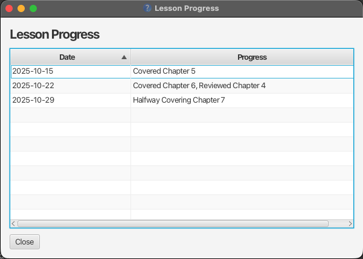

TutorTrack is a **desktop app for managing contacts, optimized for use via a Command Line Interface** (CLI) while still having the benefits of a Graphical User Interface (GUI). If you can type fast, TutorTrack can get your contact management tasks done faster than traditional GUI apps.

* Table of Contents
{:toc}

--------------------------------------------------------------------------------------------------------------------

## Quick start

1. Ensure you have Java `17` or above installed in your Computer. 
   **Mac users:** Ensure you have the precise JDK version prescribed [here](https://se-education.org/guides/tutorials/javaInstallationMac.html).

1. Download the latest `.jar` file from [here](https://github.com/AY2526S1-CS2103T-W11-4/tp/releases).

1. Copy the file to the folder you want to use as the _home folder_ for your TutorTrack.

1. Open a command terminal, `cd` into the folder you put the jar file in, and use the `java -jar tutortrack.jar` command to run the application. 
   A GUI similar to the below should appear in a few seconds. Note how the app contains some sample data. 
   

1. Type the command in the command box and press Enter to execute it. e.g. typing **`help`** and pressing Enter will open the help window. 
   Some example commands you can try:

   * `list` : Lists all contacts.

   * `add n/John Doe p/98765432 s/P4-Math d/Monday 1200 c/$60 a/John street, block 123, #01-01` : Adds a contact named `John Doe` to the Address Book.

   * `delete 3` : Deletes the 3rd contact shown in the current list.

   * `clear` : Deletes all contacts.

   * `exit` : Exits the app.

1. Refer to the [Features](#features) below for details of each command.

--------------------------------------------------------------------------------------------------------------------

## Features

**:information_source: Notes about the command format:** 

* Words in `UPPER_CASE` are the parameters to be supplied by the user. 
  e.g. in `add n/NAME`, `NAME` is a parameter which can be used as `add n/John Doe`.

* Items in square brackets are optional. 
  e.g `n/NAME [t/TAG]` can be used as `n/John Doe t/friend` or as `n/John Doe`.

* Items with `…`​ after them can be used multiple times including zero times. 
  e.g. `[t/TAG]…​` can be used as ` ` (i.e. 0 times), `t/friend`, `t/friend t/family` etc.

* Parameters can be in any order. 
  e.g. if the command specifies `n/NAME p/PHONE_NUMBER`, `p/PHONE_NUMBER n/NAME` is also acceptable.

* Extraneous parameters for commands that do not take in parameters (such as `help`, `list`, `exit` and `clear`) will be ignored. 
  e.g. if the command specifies `help 123`, it will be interpreted as `help`.

* If you are using a PDF version of this document, be careful when copying and pasting commands that span multiple lines as space characters surrounding line-breaks may be omitted when copied over to the application.

### Viewing help : `help`

Shows a message explaining how to access the help page.

Format: `help`

### Adding a person: `add`

Adds a person to the address book.

Format: `add n/NAME p/PHONE_NUMBER s/SUBJECTLEVEL d/DAYTIME c/COST a/ADDRESS [t/TAG]…​`

:bulb: **Tip:**
A person can have any number of tags (including 0)

Examples:
* `add n/John Doe p/98765432 s/P4-Math d/Monday 1200 c/$60 a/John street, block 123, #01-01`
* `add n/Betsy Crowe t/friend s/P6-Science d/Tuesday 1400 c/$50 a/Newgate Prison p/1234567 t/criminal`

### Listing all persons : `list`

Shows a list of all persons in the address book.

Format: `list`

### Editing a person : `edit`

Edits an existing person in the address book.

Format: `edit INDEX [n/NAME] [p/PHONE] [s/SUBJECTLEVEL] [d/DAYTIME] [c/COST] [a/ADDRESS] [t/TAG]…​`

* Edits the person at the specified `INDEX`. The index refers to the index number shown in the displayed person list. The index **must be a positive integer** 1, 2, 3, …​
* At least one of the optional fields must be provided.
* Existing values will be updated to the input values.
* When editing tags, the existing tags of the person will be removed i.e adding of tags is not cumulative.
* You can remove all the person’s tags by typing `t/` without
    specifying any tags after it.

Examples:
*  `edit 1 p/91234567 ` Edits the phone number of the 1st person to be `91234567`.
*  `edit 2 n/Betsy Crower t/` Edits the name of the 2nd person to be `Betsy Crower` and clears all existing tags.

### Locating persons: `find`

Finds persons whose names, tags, or lesson days match any of the given keywords.

Format: `find KEYWORD [MORE_KEYWORDS]` OR `find t/TAG_KEYWORD [MORE_TAG_KEYWORDS]` OR `find d/DAY`

**Search by Name:**
* The search is case-insensitive. e.g `hans` will match `Hans`
* The order of the keywords does not matter. e.g. `Hans Bo` will match `Bo Hans`
* By default (without prefix eg t/), the name of the student is searched using prefix matching.
* Any name token starting with the keyword will be matched e.g. `Han` will match `Hans` and `Hannah`
* **Results are ranked by relevance**: First name matches appear first, followed by last name matches, then alphabetically.
* Persons matching at least one keyword will be returned (i.e. `OR` search).
  e.g. `Hans Bo` will return `Hans Gruber`, `Bo Yang`

**Search by Tag (with `t/` prefix):**
* Only tags are searched.
* Only full words will be matched.
* The search is case-insensitive.
* Persons matching at least one tag keyword will be returned.

**Search by Lesson Day (with `d/` prefix):**
* Only searches by the lesson day (Monday, Tuesday, Wednesday, Thursday, Friday, Saturday, Sunday).
* The search is case-insensitive. e.g. `monday`, `MONDAY`, and `Monday` all work.
* **Results are automatically sorted by lesson time** (earliest to latest).
* If multiple lessons have the same time, they are sorted alphabetically by name.
* Only one day can be searched at a time.

Examples:
* `find John` returns `john` and `John Doe` (first names starting with "John" ranked higher)
* `find Jo` returns `John Doe` and `Joseph Tan` (both match first name, alphabetically sorted)
* `find alex david` returns `Alex Yeoh`, `David Li` 
  
* `find t/friends` returns all persons tagged with `friends`
* `find t/friends colleagues` returns all persons tagged with either `friends` or `colleagues`
* `find d/Monday` returns all persons with Monday lessons, sorted by lesson time (e.g., 0900 before 1400)
* `find d/tuesday` returns all persons with Tuesday lessons (case-insensitive)

### Deleting a person : `delete`

Deletes the specified person from the address book.

Format: `delete INDEX`

* Deletes the person at the specified `INDEX`.
* The index refers to the index number shown in the displayed person list.
* The index **must be a positive integer** 1, 2, 3, …​

Examples:
* `list` followed by `delete 2` deletes the 2nd person in the address book.
* `find Betsy` followed by `delete 1` deletes the 1st person in the results of the `find` command.

### Adding lesson plan : `addplan`

Adds a new lesson plan entry for a specific student.

Format:
`addplan INDEX ll/DATE|PLAN`

* Adds a lesson plan to the student at the specified `INDEX`. 
* The index refers to the index number shown in the displayed person list. 
* The index must be a positive integer 1, 2, 3, … 
* `DATE` must be in the format YYYY-MM-DD. 
* `PLAN` is a short description of the topics or activities planned for that lesson. 
* Each new entry will be added to the student’s lesson plan list. 
* Entries can later be viewed with the view command.

:bulb: **Tip:**
Use the `addplan` command to schedule and keep track of upcoming lessons for each student. 

Examples:

`addplan 1 ll/2025-10-25|Introduce quadratic equations`
Adds a lesson plan on 25 Oct 2025 for the 1st student.

`addplan 2 ll/2025-10-23|Essay writing techniques and structure`
Adds a lesson plan on 23 Oct 2025 for the 2nd student.

Expected outcome: 

* A success message will be displayed in the result box confirming that the lesson plan has been added. 
* The new entry will appear in the student’s lesson plan list, viewable using view.
* 

### Add Lesson Progress : `addprogress`

Adds a lesson progress to a student.

Format: `addprogress INDEX Date|Description`

* Adds a lesson progress entry to the student at the specified INDEX. 
* The index refers to the index number shown in the displayed person list. 
* The index must be a positive integer 1, 2, 3, … 
* `DATE` must be in the format YYYY-MM-DD. 
* `PROGRESS` is a short description of what was covered or achieved in that lesson. 
* Each new entry will be added to the student’s lesson progress history. 
* Entries can later be viewed with the view command.

:bulb: **Tip:**
Use the `addprogress` command regularly to keep an updated record of each student’s learning progress. 

Examples:

* `addprogress 1 lp/2025-10-21|Introduced new algebra concepts`
Adds a progress entry on 21 Oct 2025 for the 1st student.

* `addprogress 2 lp/2025-10-15|Reviewed essay structure and grammar`
Adds a progress entry on 15 Oct 2025 for the 2nd student.

Expected outcome: 

* A success message will be displayed in the result box confirming that the lesson progress has been added. 
* The new entry will appear in the student's lesson progress list, viewable using viewlessons. 
* 

### Viewing lesson progress : `viewlessons`

Shows the lesson progress history for a specific student in a separate window.

Format: `viewlessons INDEX`

* Views the lesson progress of the student at the specified `INDEX`.
* The index refers to the index number shown in the displayed person list.
* The index **must be a positive integer** 1, 2, 3, …​
* Opens a new window displaying all recorded lesson progress entries.
* Each entry shows the date and progress description.
* Entries can be sorted by Date

:bulb: **Tip:**
Add lesson progress using the `addprogress` command before viewing.

Examples:
* `list` followed by `viewlessons 1` opens a window showing the lesson progress for the 1st student.
* `find John` followed by `viewlessons 1` shows progress for the 1st person in the filtered results.

Expected output: 

* A new window titled "Lesson Progress" will appear.
* The window contains a table with two columns: **Date** and **Progress**.
* If the student has no lesson progress recorded, an empty table is shown.

### Clearing all entries : `clear`

Clears all entries from the address book.

Format: `clear`

### Exiting the program : `exit`

Exits the program.

Format: `exit`

### Saving the data

TutorTrack data are saved in the hard disk automatically after any command that changes the data. There is no need to save manually.

### Editing the data file

TutorTrack data are saved automatically as a JSON file `[JAR file location]/data/tutortrack.json`. Advanced users are welcome to update data directly by editing that data file.

:exclamation: **Caution:**
If your changes to the data file makes its format invalid, TutorTrack will discard all data and start with an empty data file at the next run. Hence, it is recommended to take a backup of the file before editing it. 
Furthermore, certain edits can cause the TutorTrack to behave in unexpected ways (e.g., if a value entered is outside of the acceptable range). Therefore, edit the data file only if you are confident that you can update it correctly.

### Archiving data files `[coming in v2.0]`

_Details coming soon ..._

--------------------------------------------------------------------------------------------------------------------

## FAQ

**Q**: How do I transfer my data to another Computer? 
**A**: Install the app in the other computer and overwrite the empty data file it creates with the file that contains the data of your previous TutorTrack home folder.

--------------------------------------------------------------------------------------------------------------------

## Known issues

1. **When using multiple screens**, if you move the application to a secondary screen, and later switch to using only the primary screen, the GUI will open off-screen. The remedy is to delete the `preferences.json` file created by the application before running the application again.
2. **If you minimize the Help Window** and then run the `help` command (or use the `Help` menu, or the keyboard shortcut `F1`) again, the original Help Window will remain minimized, and no new Help Window will appear. The remedy is to manually restore the minimized Help Window.

--------------------------------------------------------------------------------------------------------------------

## Command summary

Action | Format, Examples
--------|------------------
**Add** | `add n/NAME p/PHONE_NUMBER s/SUBJECTLEVEL d/DAYTIME c/COST a/ADDRESS [t/TAG]…​`   e.g., `add n/James Ho p/22224444 a/123, Clementi Rd, 1234665 t/friend t/colleague`
**Clear** | `clear`
**Delete** | `delete INDEX`  e.g., `delete 3`
**Edit** | `edit INDEX [n/NAME] [p/PHONE_NUMBER] [s/SUBJECTLEVEL] [d/DAYTIME] [c/COST] [a/ADDRESS] [t/TAG]…​`  e.g.,`edit 2 n/James Lee`
**Find** | `find KEYWORD [MORE_KEYWORDS]` (by name prefix)   `find t/TAG_KEYWORD [MORE_TAG_KEYWORDS]` (by tag)   `find d/DAY` (by lesson day, sorted by time)   e.g., `find Jo` (matches John, Joseph), `find t/friends`, `find d/Monday` 
**List** | `list`
**Help** | `help`
**Add plan** | `addplan INDEX Date Description`  e.g., `addplan 1 ll/2025-10-21\|Introduce essay writing skills`
**Add progress** | `addprogress INDEX Date Description`  e.g., `addprogress 1 lp/2025-10-21\|Introduced new algebra concepts`
**View Lessons** | `viewlessons INDEX`  e.g., `viewlessons 1`
