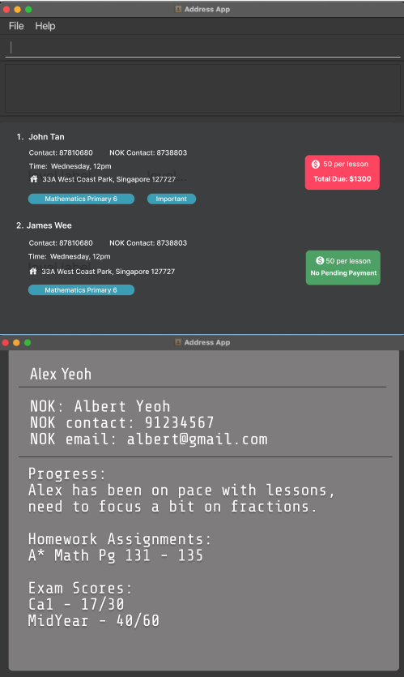
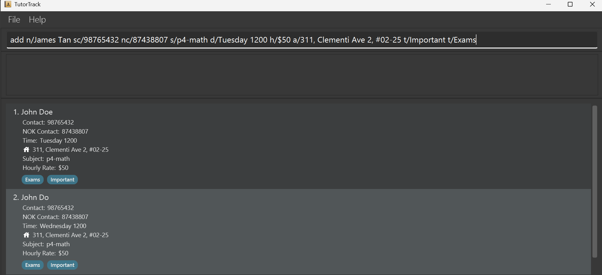
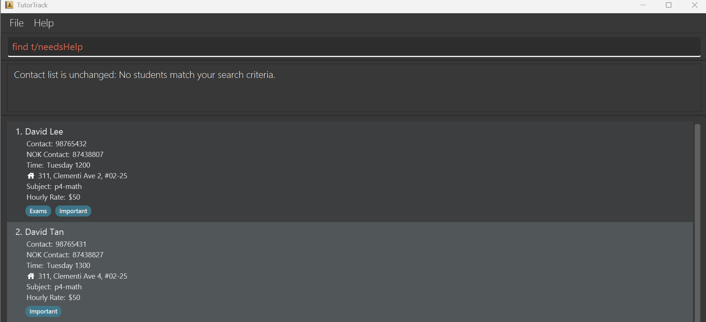
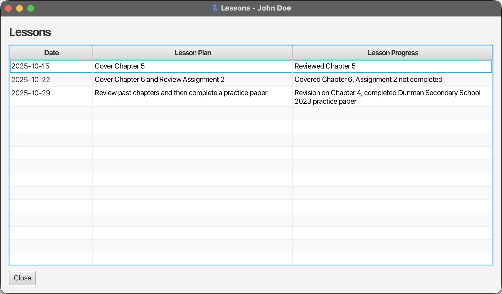
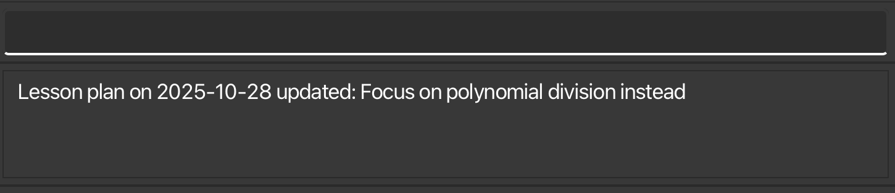
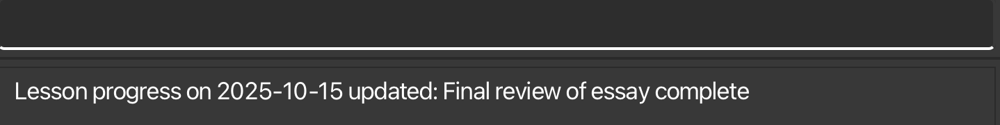

--------------------------------------------------------------------------------------------------------------------

## Introduction

TutorTrack is a centralised tool to manage lesson plans, assignments, deadlines and learning progress based on student contacts in one streamlined system. Built for tutors with many students, TutorTrack helps reduce time spent on administrative tasks and simplifies preparation of progress updates for parents. With that, tutors are empowered to focus on what matters most – marking, giving feedback, and creating targeted resources for students.

TutorTrack is optimised for use through a Command Line Interface (CLI), where users type commands to perform actions. It is also complemented by a Graphical User Interface (GUI), which allows users to interact using buttons and visual elements. Together, these interfaces gives users the speed and precision of typed commands with the clarity of visual displays. This makes student management faster and more intuitive than traditional click-based applications.

### Who this is for
- Private tutors managing multiple students who are taking different subjects and need a fast way to track lessons progress, plan lessons and manage student, parent contacts in one place.
- Part-time tutors who prefer keyboard-driven speed over mouse-driven menus
- Comfortable with basic typing with no prior coding knowledge

### Assumptions & prerequisites
1) Comfortable with basic typing with no prior coding knowledge<br>
2) Can run desktop Java apps and launch a `.jar` from a terminal using the instructions in this guide.


* Table of Contents
{:toc}

--------------------------------------------------------------------------------------------------------------------

## Quick start

1. Ensure you have Java `17` or above installed in your Computer.<br>
   **Mac users:** Ensure you have the precise JDK version prescribed [here](https://se-education.org/guides/tutorials/javaInstallationMac.html).

2. Download the latest `.jar` file from [here](https://github.com/AY2526S1-CS2103T-W11-4/tp/releases).

3. Copy the file to the folder you want to use as the _home folder_ for your TutorTrack.

4. Open a command terminal, `cd` into the folder you put the jar file in, and use the `java -jar tutortrack.jar` command to run the application.<br>
   A GUI similar to the below should appear in a few seconds. Note how the app contains some sample data.<br>

   

5. Type the command in the command box and press Enter to execute it. e.g. typing **`help`** and pressing Enter will open the help window.<br>
   Some example commands you can try:

   * `list` : Lists all contacts.

   * `add n/John Doe sc/98765432 s/P4-Math d/Monday 1200 h/$60 a/John street, block 123, #01-01` : Adds a contact named `John Doe` to the Address Book.

   * `delete 3` : Deletes the 3rd contact shown in the current list.

   * `clear` : Deletes all contacts.

   * `exit` : Exits the app.

6. Refer to the [Features](#features) below for details of each command.

--------------------------------------------------------------------------------------------------------------------

## Features

<div markdown="block" class="alert alert-info">

**:information_source: Notes about the command format:**<br>

**Parameter Notation:**
* Words in `UPPER_CASE` are parameters to be supplied by the user.
  - Example: in `add n/NAME`, `NAME` is a parameter which can be used as `add n/John Doe`.

* Items in square brackets are optional.
  - Example: `n/NAME [t/TAG]` can be used as `n/John Doe t/friend` or as `n/John Doe`.

* Items with `…`​ after them can be used multiple times including zero times.
  - Example: `[t/TAG]…​` can be used as ` ` (i.e. 0 times), `t/friend`, `t/friend t/family` etc.

**Command Flexibility:**
* Parameters can be in any order.
  - Example: if the command specifies `n/NAME s/SUBJECTLEVEL`, `s/SUBJECTLEVEL n/NAME` is also acceptable.

* Extraneous parameters for commands that do not take in parameters (such as `help`, `list`, `exit` and `clear`) will be ignored.
  - Example: if the command specifies `help 123`, it will be interpreted as `help`.

**INDEX:**
* Refers to the index number shown in the displayed person list, which **starts from 1**.
* The index **must be a positive integer** 1, 2, 3, …​
* Example: the command `edit 2 n/NAME` will edit the name of the 2nd person in the list.

**PDF Users:**
* If you are using a PDF version of this document, be careful when copying and pasting commands that span multiple lines as space characters surrounding line-breaks may be omitted when copied over to the application.
</div>

### Viewing help : `help`

Shows a pop-up message explaining how to access the help page.


Format: `help`

### Adding a person: `add`

Adds a student to the address book.

Format: `add n/NAME s/SUBJECTLEVEL d/DAYTIME h/HOURLYRATE a/ADDRESS [sc/SELFCONTACT] [nc/NOKCONTACT] [t/TAG]…​`

* `sc/SELFCONTACT` is the student's own contact number.

* `nc/NOKCONTACT` is the next-of-kin's contact number.

* At least one of `sc/` or `nc/` must be provided and contain a valid phone number.

* It is not allowed for both fields to be missing.

<div markdown="span" class="alert alert-primary">:bulb: **Tip:**
A person can have any number of tags (including 0)
</div>

<div markdown="block" class="alert alert-info">

**:information_source: Notes on Tags:**<br>

* Tags must be **single words** with no spaces (alphanumeric characters only).
* **If necessary**, for multi-word concepts, use **camelCase** (e.g., `needsHelp`, `topStudent`, `paidInFull`).
* Examples of valid tags:
  - `friend`, `colleague`, `vip`
  - `needsHelp`, `topStudent`, `examsAreUpcoming` (camelCase for multi-word tags)
* Examples of invalid tags:
  - `needs help` (contains space - use `needsHelp` instead)
  - `top-student` (contains hyphen - use `topStudent` instead)
  - `exams_are_upcoming` (contains underscore - use `examsAreUpcoming` instead)

</div>

Examples of add command:
* `add n/John Doe sc/98765432 s/P4-Math d/Monday 1200 h/$60 a/John street, block 123, #01-01`
* `add n/Betsy Crowe t/friend s/Primary6-Science d/Tuesday 1400 h/$50 a/Newgate sc/12345678`

<div markdown="block" class="alert alert-info">

**:information_source: Notes on SubjectLevel validation:**<br>

* Format: Subject level must be in the form `Level-Subject` where the two parts are separated by a single dash (`-`).
  - The "Level" part may contain letters and digits (alphanumeric) and must not contain spaces (examples: `P4`, `P6`, `Pri6`, `Primary6`, `Sec1`).
  - The "Subject" part may contain letters and digits (alphanumeric, no spaces, no punctuation) and represents the subject name (examples: `Math`, `English`, `Science`).
* Examples of valid subject-level tokens:
  - `P4-Math`, `P6-Science`, `Pri6-Math`, `Primary6-Mathematics` (note: `Mathematics` must be a single word without spaces)
  - `Sec1-English`, `Sec2-Physics`
* Examples of invalid subject-level tokens and why they are rejected:
  - `P4 Math` (missing dash between level and subject)
  - `P4-Math-Advanced` (extra dash; only a single dash separator is allowed)
  - `Primary 6-Math` (spaces in the level part are not allowed)

If you enter an invalid subject-level, the parser will show an error message explaining the required format so you can correct it.
</div>


**:information_source: Notes on DayTime validation:**<br>

* Format: DayTime must be in the form `DAY TIME`, where `DAY` and `TIME` are separated by a single space.
  - The `DAY` part must be a **full day name** (case-insensitive), and must be one of the following:  
    `Monday`, `Tuesday`, `Wednesday`, `Thursday`, `Friday`, `Saturday`, `Sunday`.  
    *(e.g., both `Monday` and `monday` are accepted)*
  - The `TIME` part must be a **4-digit 24-hour format** number (`HHMM`) representing the lesson start time.
    - Valid range: `0000` (12:00 AM) to `2359` (11:59 PM)
* Examples of valid DayTime tokens:
  - `Monday 0900`, `wednesday 1530`, `SUNDAY 2300`
* Examples of invalid DayTime tokens and why they are rejected:
  - `Mon 0900` (abbreviated day name not allowed)
  - `Monday9am` (missing space and incorrect time format)
  - `Monday 24:00` (invalid time format; must be 4 digits without colon)
  - `Monday 2500` (invalid hour; exceeds 2359)
  - `Funday 1200` (invalid day name)
</div>

#### Example Usage

Below is an example showing how to add a contact with all the required fields:



The command shown: `add n/James Tan sc/98765432 nc/87438807 s/p4-math d/Tuesday 1200 h/$50 a/311, Clementi Ave 2, #02-25 t/Important t/Exams`

This adds a student "James Tan" with both student contact (98765432) and NOK contact (87438807), taking P4-Math on Tuesday at 12:00 PM, with an hourly rate of $50, at the specified address, and with two tags: "Important" and "Exams".
<div markdown="block" class="alert alert-info">

#### Example Usage

Below is an example showing how to add a contact with all the required fields:


The command shown: `add n/James Tan sc/98765432 nc/87438807 s/p4-math d/Tuesday 1200 h/$50 a/311, Clementi Ave 2, #02-25 t/Important t/Exams`

This adds a student "James Tan" with both student contact (98765432) and NOK contact (87438807), taking P4-Math on Tuesday at 12:00 PM, with an hourly rate of $50, at the specified address, and with two tags: "Important" and "Exams".

#### Expected output
- A success message appears in the result box and the new person appears in the list.

> **Tip:** Provide either `sc/` (student contact) or `nc/` (next-of-kin). You can add the other later using `edit`.

### Listing all persons : `list`

Shows a list of all persons in the address book.

Format: `list`

#### Expected output
- The full list of persons is displayed.

### Editing a person : `edit`

Edits an existing person in the address book.

Format: `edit INDEX [n/NAME] [sc/SELFCONTACT] [nc/NOKCONTACT] [s/SUBJECTLEVEL] [d/DAYTIME] [h/HOURLYRATE] [a/ADDRESS] [t/TAG]…​`

* Edits the person at the specified `INDEX`.
* At least one of the optional fields must be provided.
* Existing values will be updated to the input values.
* When editing tags, the existing tags of the person will be removed i.e adding of tags is not cumulative.
* You can remove all the person’s tags by typing `t/` without specifying any tags after it.

Examples:
*  `edit 1 s/P4-Math ` Edits the subject level of the 1st person to be `P4-Math`.
*  `edit 2 n/Betsy Crower t/` Edits the name of the 2nd person to be `Betsy Crower` and clears all existing tags.

#### Expected output
- A success message appears in the result box showing the edited person and its updated data.

#### Common errors
- No fields provided: "At least one field to edit must be provided."

### Locating persons: `find`

Finds persons whose names, tags, or lesson days match any of the given keywords.

Format: `find KEYWORD [MORE_KEYWORDS]` OR `find s/SUBJECTLEVEL` OR `find t/TAG_KEYWORD [MORE_TAG_KEYWORDS]` OR `find d/DAY`

<div markdown="span" class="alert alert-warning">:exclamation: **Important:**
Only one search type can be used per command. You cannot combine different prefixes (e.g., `find t/friends d/Monday` is not allowed).
</div>

#### Search by Name

**Basic Search Rules:**
* Case-insensitive - `hans` will match `Hans`
* Keyword order doesn't matter - `find Hans Bo` gives the same results as `find Bo Hans`
* Uses **prefix matching** - matches any word in the name that starts with your search keyword.
  - Example: searching `Han` will match both `Hans` and `Hannah` (because both start with "Han")
* **OR search** - displays students matching **any** of the keywords (not all)
  - Example: `find Hans Bo` displays:
    - `Hans Gruber` (first name matches "Hans")
    - `Bo Yang` (first name matches "Bo")


**Result Ranking:**

Results are automatically sorted by relevance:
1. **First name matches** - appear first (highest priority)
   - Example: searching `John` → `John Doe` appears before `Mary Johnson`
2. **Other name matches** - appear second (last name, middle name, etc.)
   - Example: searching `John` → `Mary Johnson` appears after `John Doe`
3. **Alphabetical within each priority** - results are sorted by full name (case-insensitive)

**Important:** First name matches will **always** appear before other name matches, regardless of alphabetical order. 

> **Note:** All non-first name matches (2nd, 3rd, 4th token, etc.) have equal priority.

Examples:
**Ranking Examples for "find Jo":**
* **Priority 1** (First name matches):
  - `Joanna Lee Smith`
  - `John Michael Smith`
  - `Joseph Tan`
* **Priority 2** (Non-first name matches):
  - `Alice Jordan Lee` (2nd token match)
  - `Alice Jones Tan` (2nd token match)
  - `Mary Smith Jones` (3rd token match)


**Example output for `find alex david`:**


#### Search by Tag (with `t/` prefix)
* Only tags are searched.
* Only full words will be matched.
* The search is case-insensitive.
* Persons matching at least one tag keyword will be returned.

Examples:
* `find t/friends` returns all persons tagged with `friends`
* `find t/friends colleagues` returns all persons tagged with either `friends` or `colleagues`

Common error:
* `find t/friends t/colleagues` Error: "Duplicate t/ prefix found. To search multiple tags, separate keywords with spaces. Example: find t/jake john"
  - Use `find t/friends colleagues` instead.

#### Search by Lesson Day (with `d/` prefix)
* Only searches by the lesson day (Monday, Tuesday, Wednesday, Thursday, Friday, Saturday, Sunday).
* **Day must be a valid day of the week** — full day names only (e.g., `Monday`, `Tuesday`). Abbreviations (e.g., `Mon`, `Tue`) or invalid day names will be rejected with an error message.
* The search is case-insensitive. e.g. `monday`, `MONDAY`, and `Monday` all work.
* **Results are automatically sorted by lesson time** (earliest to latest).
* If multiple lessons have the same time, they are sorted alphabetically by name (case-insensitive).
* Only one day can be searched at a time.

Examples:
* `find d/Monday` returns all persons with Monday lessons, sorted by lesson time (e.g., 0900 before 1400)
* `find d/tuesday` returns all persons with Tuesday lessons (case-insensitive)
* `find d/Mon` Error: "Invalid day: Please enter a valid day of the week without abbreviations (e.g. Monday to Sunday)."
* `find d/Tomorrow` Error: "Invalid day: Please enter a valid day of the week without abbreviations (e.g. Monday to Sunday)."

Common error:
* `find d/Monday d/Tuesday` Error: "Duplicate d/ prefix found. Only one day can be searched at a time."

#### Search by Subject (with `s/` prefix)
* Only searches by the person's subject level. The subject level uses the format `Level-Subject` (e.g., `P4-Math`, `Sec1-English`).
* The search is case-insensitive and matches full subject-level tokens (so `s/P4-Math` matches `P4-Math` regardless of case).
* Results are not specially ranked for subject matches (they are returned in the current list order or as provided by the command context).

Examples:
* `find s/P4-Math` returns all persons whose subject level is `P4-Math` (case-insensitive)

Common error:
* `find s/P4-Math s/Sec1-English` Error: "Duplicate s/ prefix found. Only one subject can be searched at a time."

#### Common errors 
The following errors apply to all variations of the find command:
- No matches: "Contact list is unchanged: No students match your search criteria."
- Multiple prefixes: "Only one search type can be used at a time. Please use either t/ (tag), s/ (subject), or d/ (day), but not multiple prefixes."
  - Example: `find t/friends d/Monday` will trigger this error.

<div markdown="span" class="alert alert-warning">:exclamation: **Note:**
If no persons match your search criteria, an error message will be displayed and your current list will remain unchanged. The search command will stay in the command box with the text in red so you can easily edit and retry your search.
</div>

**Example of a failed find command:**




### Deleting a person : `delete`

Deletes the specified person from the address book.

Format: `delete INDEX`

* Deletes the person at the specified `INDEX`.

Examples:
* `list` followed by `delete 2` deletes the 2nd person in the address book.
* `find Betsy` followed by `delete 1` deletes the 1st person in the results of the `find` command.

#### Expected output
- "Deleted Person: …" appears in the result box and the person is removed from the list.

## Lesson Management Commands

TutorTrack allows tutors to add, edit, and delete lesson plans and lesson progress for each student.

<div markdown="block" class="alert alert-info">

**:information_source: Notes about the Lesson Management command format:**<br>

**INDEX:**
* Refers to the index number shown in the displayed person list, which **starts from 1**.
* The index **must be a positive integer** 1, 2, 3, …​
* Example: `deleteplan 3 DATE` deletes the lesson plan for the 3rd student in the list on the specified `DATE`.

**DATE:**
* Represents the day of a lesson.
* Each student can have **at most one** `PLAN` and one `PROGRESS` per lesson day.
* Must be in the format `YYYY-MM-DD` (e.g., `2025-10-30`).
  - Invalid formats: `Oct 30, 2025`, `2025/10/30`
* Month (MM) must be between 1 and 12 inclusive.
* Day (DD) must be between 1 and 31 inclusive.

**PLAN and PROGRESS:**
* `PLAN` is a short description of the topics or activities planned for that lesson.
* `PROGRESS` is a short description of what was covered or achieved in that lesson.
* Prefix for `PLAN` is `pl/`.
* Prefix for `PROGRESS` is `pr/`.
* Must use `|` to separate `DATE` and `PLAN`/`PROGRESS`.
  - Valid format: `addplan INDEX pl/DATE|PLAN`
  - Invalid formats: `addplan INDEX pl/DATE, PLAN` or `addplan INDEX pl/DATE PLAN`

**Command Case Sensitivity:**
* All lesson management commands must use lowercase letters.
* Examples: `addplan`, `editplan`, `deleteprogress`, `viewlessons`

</div>

### Viewing Lesson Window : `viewlessons`

Shows the lesson plan and progress history for a specific student in a separate window.

Format: `viewlessons INDEX`

* Views the lesson plan and progress of the student at the specified `INDEX`.
* Opens a new window displaying all recorded lesson progress entries.
* Each entry shows the date and progress description.
* Entries are sorted by date in chronological order.
* **Text formatting** (line breaks, tabs) added using `\n` and `\t` in `addplan` or `addprogress` will be properly displayed.

> **Tip:**
> 1. Add lesson plan using the `addplan` command before viewing<br>
> 2. Add lesson progress using the `addprogress` command before viewing.

Examples:
* `list` followed by `viewlessons 1` opens a window showing the lesson window for the 1st student.
* `find John` followed by `viewlessons 1` shows the lesson window for the 1st person in the filtered results.

Expected output:<br>

* A new window titled "Lessons - [Student Name]" will appear.
* The window contains a table with three columns: **Date**, **Lesson Plan** and **Lesson Progress**.
* Multi-line entries will display properly with line breaks preserved.
* The columns automatically adjust to fit your content with text wrapping enabled.
* If the student has no lesson plan or lesson progress recorded, an empty table is shown.

### Adding lesson plan : `addplan`

Adds a new lesson plan entry for a specific student.

Format:
`addplan INDEX pl/DATE|PLAN`

* Adds a lesson plan to the student at the specified `INDEX`.
* Each new entry will be added to the student's lesson plan list.
* Entries can later be viewed with the `viewlessons` command.

<div markdown="span" class="alert alert-info">:bulb: **Formatting Your Lesson Plan:**

You can use special characters to format your lesson plans for better readability:
* **`\n`** - Creates a new line (line break)
* **`\t`** - Adds a tab space for indentation
* **`\\`** - Displays a backslash character
* **`\\n`** - Displays the literal text "\n" (not a line break)
* **`\\t`** - Displays the literal text "\t" (not a tab)

These formatting options are especially useful for:
- helping you organize multi-part lessons
- Highlighting key sections or steps
- Clearly separating different components of your plan
</div>

> **Tip:**
> Use the `addplan` command to schedule and keep track of upcoming lessons for each student.

> **Tip:**
> In the case that you forgot to add plan for a past lesson, TutorTrack allows you to backdate a plan to keep your records complete.

Examples:

* `addplan 1 pl/2025-10-15|Cover Chapter 5`
Adds a simple, single-line lesson plan on 15 Oct 2025 for the 1st student.

* `addplan 2 pl/2025-10-22|Cover Chapter 6 and Review Assignment 2`
Adds a lesson plan on 22 Oct 2025 for the 2nd student.

* `addplan 1 pl/2025-11-05|Warm-up: Quick quiz on last week's topics\nMain: Introduce quadratic equations\nHomework: Complete worksheet 5`
Adds a structured, multi-line lesson plan on 5 Nov 2025 for the 1st student. When you view this in the `viewlessons` window, it will display as:
  ```
  Warm-up: Quick quiz on last week's topics
  Main: Introduce quadratic equations
  Homework: Complete worksheet 5
  ```

* `addplan 3 pl/2025-11-10|Topic 1:\tLinear equations\nTopic 2:\tQuadratic equations`
Adds a lesson plan with tabs for alignment. This will display as:
  ```
  Topic 1:    Linear equations
  Topic 2:    Quadratic equations
  ```

* `addplan 2 pl/2025-11-12|Reminder: Use \\n for line breaks and \\t for tabs\nChapter 7: Variables`
Adds a lesson plan with literal escape sequences. This will display as:
  ```
  Reminder: Use \n for line breaks and \t for tabs
  Chapter 7: Variables
  ```

Expected outcome:<br>

* A success message will be displayed in the result box confirming that the lesson plan has been added.
* The new entry will appear in the student’s lesson plan list, viewable using `viewlessons`.
* 

### Edit Lesson Plan : `editplan`

Updates an existing lesson plan entry for a student.

Format: `editplan INDEX pl/DATE|NEW_PLAN`

* Updates an existing lesson plan entry for the student at the specified INDEX.
* **The input `DATE` must match an existing lesson plan entry for the student.**<br>
  If no lesson plan or more than one lesson plan entry is found for the specified date, an error message will be shown.
* `NEW_PLAN` is the new description for the lesson plan, which will overwrite the old entry for that date.
* You can use formatting characters (`\n`, `\t`, `\\`) in your new plan, just like in `addplan`.

> **Tip:**
> Use `editplan` to adjust future lesson plans as a student's needs change. Use `viewlessons` first to see which dates have entries you can edit.

Examples:

* `editplan 1 pl/2025-10-28|Focus on polynomial division instead`
  Updates the lesson plan for 28 Oct 2025 for the 1st student with the new description.

* `editplan 2 pl/2025-10-22|Introduction:\tThesis statements\nMain:\tEssay structure\nPractice:\tWrite opening paragraph`
  Updates the lesson plan for 22 Oct 2025 with a structured, multi-line format.

Expected outcome:

* A success message will be displayed in the result box confirming that the lesson plan has been updated.
* The updated entry will appear in the student's lesson plan list, viewable using `viewlessons`.
* 

### Deleting lesson plan : `deleteplan`

Deletes a lesson plan entry for a specific student on a given date.

Format: `deleteplan INDEX DATE`

* Deletes the lesson plan for the student at the specified `INDEX` on the specified `DATE`.
* The lesson plan on that date must exist. If no lesson plan exists on that date, an error message will be shown.

Examples:

* `deleteplan 1 2025-10-25` deletes the lesson plan for the 1st student on 25 Oct 2025.
* `deleteplan 2 2025-02-28` deletes the lesson plan for the 2nd student on 28 Feb 2025.

### Add Lesson Progress : `addprogress`

Adds a lesson progress to a student.

Format: `addprogress INDEX pr/DATE|PROGRESS`

* Adds a lesson progress entry to the student at the specified INDEX.
* Each new entry will be added to the student's lesson progress history.
* Entries can later be viewed with the `viewlessons` command.

<div markdown="span" class="alert alert-info">:bulb: **Formatting Your Lesson Progress:**

You can use special characters to format your progress entries for better readability:
* **`\n`** - Creates a new line (line break)
* **`\t`** - Adds a tab space for indentation
* **`\\`** - Displays a backslash character
* **`\\n`** - Displays the literal text "\n" (not a line break)
* **`\\t`** - Displays the literal text "\t" (not a tab)

These formatting options are especially useful for:
- Listing topics covered during the lesson
- Separating completed tasks from homework or follow-ups
- Structuring detailed progress notes clearly
</div>

> **Tip:**
> Use the `addprogress` command regularly to keep an updated record of each student's learning progress.

> **Tip:**
> If you want to record progress for a planned lesson in advance, TutorTrack allows you to pre-record it to save time. You can always edit it later if there are any changes.

Examples:

* `addprogress 1 pr/2025-10-15|Reviewed Chapter 5`
Adds a simple, single-line progress entry on 15 Oct 2025 for the 1st student.

* `addprogress 2 pr/2025-10-22|Covered Chapter 6, Assignment 2 not completed`
Adds a progress entry on 22 Oct 2025 for the 2nd student.

* `addprogress 1 pr/2025-10-30|Completed differentiation\nStarted integration basics\nHomework: Practice questions 1-10`
Adds a structured, multi-line progress entry on 30 Oct 2025 for the 1st student. When you view this in the `viewlessons` window, it will display as:
  ```
  Completed differentiation
  Started integration basics
  Homework: Practice questions 1-10
  ```

* `addprogress 3 pr/2025-11-01|Topics covered:\n\t- Quadratic equations\n\t- Factorization\n\t- Completing the square\nQuiz score: 85%`
Adds a detailed progress report with indentation. This will display as:
  ```
  Topics covered:
      - Quadratic equations
      - Factorization
      - Completing the square
  Quiz score: 85%
  ```

* `addprogress 1 pr/2025-11-05|Student asked about \\n character\nExplained it creates line breaks`
Adds a progress entry with literal escape sequences. This will display as:
  ```
  Student asked about \n character
  Explained it creates line breaks
  ```

Expected outcome:<br>

* A success message will be displayed in the result box confirming that the lesson progress has been added.
* The new entry will appear in the student's lesson progress list, viewable using `viewlessons`.
* 

### Edit Lesson Progress : `editprogress`

Updates an existing lesson progress entry for a student.

Format: `editprogress INDEX pr/DATE|NEW_PROGRESS`

* Updates an existing lesson progress entry for the student at the specified INDEX.
* **The input `DATE` must match an existing progress entry for the student.**<br>
  If no progress entry or more than one progress entry is found for the specified date, an error message will be shown.
* `NEW_PROGRESS` is the new description for the lesson progress, which will overwrite the old entry for that date.
* You can use formatting characters (`\n`, `\t`, `\\`) in your new progress, just like in `addprogress`.

> **Tip:**
> Use `editprogress` to correct mistakes or add details to a past lesson's entry. Use `viewlessons` first to see which dates have entries you can edit.

Examples:

* `editprogress 1 pr/2025-10-21|Also covered simultaneous equations`
  Updates the progress entry from 21 Oct 2025 for the 1st student with the new description.

* `editprogress 2 pr/2025-10-15|Essay review completed\nStrengths: Good thesis\nAreas to improve: Conclusion needs work`
  Updates the progress entry from 15 Oct 2025 for the 2nd student with a detailed, multi-line update.

Expected outcome:

* A success message will be displayed in the result box confirming that the lesson progress has been updated.
* The updated entry will appear in the student's lesson progress list, viewable using `viewlessons`.
* 

### Deleting lesson progress : `deleteprogress`

Deletes a lesson progress entry for a specific student on a given date.

Format: `deleteprogress INDEX DATE`

* Deletes the lesson progress for the student at the specified `INDEX` on the specified `DATE`.
* **The lesson progress on that date must exist.** If no lesson progress exists on that date, an error message will be shown.

Examples:

* `deleteprogress 1 2025-10-21` deletes the lesson progress for the 1st student on 21 Oct 2025.
* `deleteprogress 2 2025-02-28` deletes the lesson progress for the 2nd student on 28 Feb 2025.

### Clearing all entries : `clear`

Clears all entries from the address book.

Format: `clear`

### Exiting the program : `exit`

Exits the program.

Format: `exit`

### Saving the data

TutorTrack data are saved in the hard disk automatically after any command that changes the data. There is no need to save manually.

### Editing the data file

TutorTrack data are saved automatically as a JSON file `[JAR file location]/data/addressbook.json`. Advanced users are welcome to update data directly by editing that data file.

<div markdown="span" class="alert alert-warning">:exclamation: **Caution:**
If your changes to the data file makes its format invalid, TutorTrack will discard all data and start with an empty data file at the next run. Hence, it is recommended to take a backup of the file before editing it.<br>
Furthermore, certain edits can cause the TutorTrack to behave in unexpected ways (e.g., if a value entered is outside of the acceptable range). Therefore, edit the data file only if you are confident that you can update it correctly.
</div>


--------------------------------------------------------------------------------------------------------------------

## FAQ

**Q**: How do I transfer my data to another Computer?<br>
**A**: Install the app in the other computer and overwrite the empty data file it creates with the file that contains the data of your previous TutorTrack home folder.<br>

**Q**: What is the difference between lesson plan and lesson progress?<br>
**A**: Lesson Plan represents what is intended to be taught in a future lesson. Lesson Progress represents what was actually covered in a past lesson.

**Q**: Can I add plans for past dates and progresses for future dates?<br>
**A**: Yes, You can add plans for past dates (for example, if you forgot to record a previous lesson) and progresses for future dates (to update them in advance). You can always edit them later if there are any changes.

**Q**: Are users allowed to create their own command syntax?<br>
**A**: No, but it could be an extension for future.

**Q**: How do I create multi-line lesson plans or progress entries?<br>
**A**: Use `\n` to create line breaks in your text. For example: `addplan 1 pl/2025-10-30|Warm-up\nMain lesson\nHomework`. This will display each section on a separate line in the `viewlessons` window.

**Q**: Can I use tabs or special formatting in my entries?<br>
**A**: Yes! You can use `\t` for tabs (indentation), `\n` for new lines, and `\\` to display a backslash. These help organize your lesson plans and progress notes.

**Q**: How do I type the literal text "\n" or "\t" instead of creating a line break or tab?<br>
**A**: Use double backslashes: type `\\n` to display the text "\n" and `\\t` to display the text "\t". For example: `addplan 1 pl/2025-10-30|Note: Type \\n for newline` will display as "Note: Type \n for newline".

**Q**: What happens to my formatting when I edit an entry?<br>
**A**: Your existing formatting is preserved. When you edit an entry, you can keep, modify, or add new formatting using the same special characters (`\n`, `\t`, `\\`).

--------------------------------------------------------------------------------------------------------------------

## Known issues

1. **When using multiple screens**, if you move the application to a secondary screen, and later switch to using only the primary screen, the GUI will open off-screen. The remedy is to delete the `preferences.json` file created by the application before running the application again.
2. **Very long text in any field may be truncated in the UI.**
  - If a field (for example, a tag, name, or address) contains an extremely long string, the UI may display an ellipsis or cut off the text when rendering the person card or other compact views.
  - This is a display/UX limitation rather than data loss — the full text remains stored. We intentionally avoid imposing strict length limits on input fields so as not to restrict users' freedom to store detailed information.
  - Workaround: prefer shorter tokens for tags and shorter summaries for fields that will be displayed in compact views. A future release may add optional truncation/tooltip behaviour to improve readability.

--------------------------------------------------------------------------------------------------------------------

## Command summary

 Action              | Format, Examples
---------------------|----------------------------------------------------------------------------------------------------------------------------------------------------------------------------------------------------------------------------------------------------------------------------------------------------------
 **Add**             | `add n/NAME s/SUBJECTLEVEL d/DAYTIME h/HOURLYRATE a/ADDRESS [sc/SELFCONTACT] [nc/NOKCONTACT] [t/TAG]…​` <br> e.g., `add n/James Ho sc/22224444 s/P4-Math d/Monday 1200 h/$60 a/123, Clementi Rd, 1234665 t/friend`
 **Clear**           | `clear`
 **Delete**          | `delete INDEX`<br> e.g., `delete 3`
 **Edit**            | `edit INDEX [n/NAME] [sc/SELFCONTACT] [nc/NOKCONTACT] [s/SUBJECTLEVEL] [d/DAYTIME] [h/HOURLYRATE] [a/ADDRESS] [t/TAG]…​`<br> e.g.,`edit 2 n/James Lee sc/91234567`
 **Find**            | `find KEYWORD [MORE_KEYWORDS]` (by name prefix) <br> `find s/SUBJECT_LEVEL` (by subject level) <br> `find t/TAG_KEYWORD [MORE_TAG_KEYWORDS]` (by tag) <br> `find d/DAY` (by lesson day, sorted by time) <br> e.g., `find Jo` (matches John, Joseph), `find s/P4-Math`, `find t/friends`, `find d/Monday`
 **List**            | `list`
 **Help**            | `help`
 **Add plan**        | `addplan INDEX pl/DATE|PLAN`<br> e.g., `addplan 1 pl/2025-10-21\|Introduce essay writing skills`
 **Edit plan**       | `editplan INDEX pl/DATE\|NEW_PLAN`<br> e.g., `editplan 1 pl/2025-10-21\|Review essay writing and grammar`
 **Delete plan**     | `deleteplan INDEX DATE`<br> e.g., `deleteplan 1 2025-10-21`
 **Add progress**    | `addprogress INDEX pr/DATE\|PROGRESS`<br> e.g., `addprogress 1 pr/2025-10-21\|Introduced new algebra concepts`
 **Edit progress**   | `editprogress INDEX pr/DATE\|NEW_PROGRESS`<br> e.g., `editprogress 1 pr/2025-10-21\|Completed algebra concepts`
 **Delete progress** | `deleteprogress INDEX DATE`<br> e.g., `deleteprogress 1 2025-10-21`
 **View Lessons**    | `viewlessons INDEX`<br> e.g., `viewlessons 1`

--------------------------------------------------------------------------------------------------------------------

## Glossary
* **CLI(Command Line Interface)**: A method of interacting with the application by typing textual commands.
* **GUI(Graphical User Interface)**: The visual component of TutorTrack that includes panels, buttons, and lists, allowing users to view and interact with data.
* **Home folder**: The folder on the user’s computer that contains the TutorTrack JAR file and the data storage files.
* **JSON File**: A structured data file (JavaScript Object Notation format) used by TutorTrack to store application data. You are not required to modify this file manually.
* **JAR File**: A Java ARchive file that contains all the components of the TutorTrack application. It can be executed using the java -jar tutortrack.jar command.
* **Terminal**: The text-based interface on the user’s computer used to execute system commands.
* **Index**: The numerical identifier displayed beside each person in the list. The index starts from 1 and is used to specify a person when executing commands.
* **Parameter**: A variable part of a command that the user replaces with specific information. For example, in `add n/NAME`, the parameter `NAME` is replaced with the actual name of the person.
* **Prefix**: A short label ending with / that indicates the type of information provided in a command. For example, `n/` denotes name, `a/` denotes address, and `pr/` denotes lesson progress.
* **Field**: A specific category of data stored for each person (e.g., name, phone number, subject). Each field is typically associated with a prefix.
* **Error Message**: A message displayed when a command cannot be executed, indicating the cause of the error and how to correct it.
* **Success Message**: A message displayed after a command executes successfully, confirming that the intended action has been completed.
* **Plan**: A record representing the intended topic or material to be covered in a future lesson.
* **Progress**: A record representing what was actually covered or achieved during a past lesson.
* **Window**: A display component of the GUI that presents specific information or functions (e.g., Help Window, Lesson Window).
